# Yat-Sched

Proj291: 给Linux内核调度机制新增一个调度器——考虑互斥同步的硬实时调度实现

## 队伍介绍

我们队伍名称为**上士闻道勤而习之**，来自中山大学，基本情况如下：

|赛题|<a href=https://github.com/oscomp/proj291-Linux-kernel-scheduler>proj291-Linux-kernel-scheduler</a>|
|-|-|
|小组成员|黄政菘、薛沐恩、刘洋|
|指导老师|赵帅、黎卫兵|
|校外指导|刘冬华（国科环宇）|

## 文档 & 代码仓库

---

+ **决赛最终项目报告**: [PDF 网页链接](https://gitlab.eduxiji.net/T202410558992534/project2210132-225387/-/raw/main/report/Yat-Sched%E8%AE%BE%E8%AE%A1%E5%BC%80%E5%8F%91%E6%96%87%E6%A1%A3.pdf)
+ **演示视频**: 

> 链接：https://pan.baidu.com/s/1aZ3wQG2YX5h2QDoEKoTYPg?pwd=yyds 
> 提取码：yyds

---

+ **项目用户层Lib代码**: [yat_lib](https://gitlab.eduxiji.net/T202410558992534/project2210132-225387/-/tree/main/src/yat_lib)
+ **项目所改动的Linux内核代码所在仓库（Linux内核太大传不上）**: [GitHub 网页链接](https://github.com/wi1sonh/yat_sched)

## 项目简介

**（本readme文件是一个速览，详情请看决赛文档）**


<!--  -->

### 背景介绍

随着计算需求的多样化和计算环境的复杂化，现有的Linux内核调度策略虽然能够满足大多数标准应用的需求，但在特定场景下（如**实时系统**、大数据处理、高性能计算等）仍有改进和优化的空间。深入Linux内核调度机制，**设计并实现新的调度策略**或优化现有调度器，以提升系统性能，增强系统的适应性和效率，这在当下有很大的必要性。

### 项目完成情况

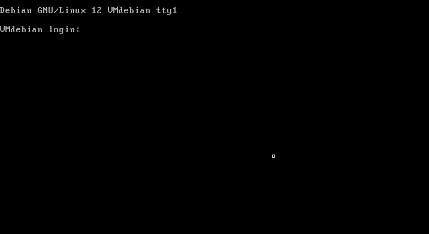

本项目面向题目所提的要求，旨在完成以下三个目标，目前均已完成，完成度 **100%** ：

| 目标描述 | 完成情况 | 说明 |
| - | - | - |
| **目标1**: 设计并实现至少一个针对特定应用场景优化的Linux内核调度器 |  已完成  | 如上图展示，我们设计并实现了一个针对实时系统做算法优化的调度器，具体的场景优化可以参考以下性能测试报告 |
| **目标2**: 对比分析新调度器与现有调度策略的性能差异 | 已完成  | 我们将调度器分成不同的模块，其中算法模块包含主要的调度策略（SPO、RAF），经测试均优于现有的一些调度策略 |
| **目标3**: 提供详细的设计文档、实现指南和性能评估报告 | 已完成  | 详见我们项目的最终报告 |


### 系统框架设计

**Yat-Sched**, 全称Yet Another Toy Scheduler, 一款基于前沿的实时调度理论技术，面向新Linux内核的具有高效性能的实时调度器。

我们将Yat-Sched初步定位为一款支持X86和ARM等体系结构、基于Linux内核的硬实时调度器，将会应用*前沿*的实时调度理论技术，面向*较新LTS版*的Linux 5.4内核，实现目前Linux内核实时调度下的*高效*性能。基于Linux内核是指Yat-Sched将改造Linux内核的调度机制，支持随机任务模型，提供新的同步算法。

整个调度器基于FPFPS（Fully Paritioned Fixed-Priority Scheduling）实现，由**内核态的 yat 调度类**、**用户态的 yat_lib** 接口调用与任务测试模块、**调度算法**模块（包含面向资源的优先级排序算法SPO、考虑阻塞的任务分配机制RAF）、**同步处理机制**（采用多核互斥资源共享协议MSRP）和**调度跟踪yat_trace**模块这五个部分组成。

Yat-Sched由五部分组成：底层数据结构部分、调度算法部分、同步处理机制部分、调度跟踪部分、系统调用部分。下图表示了各个部分及其联系：

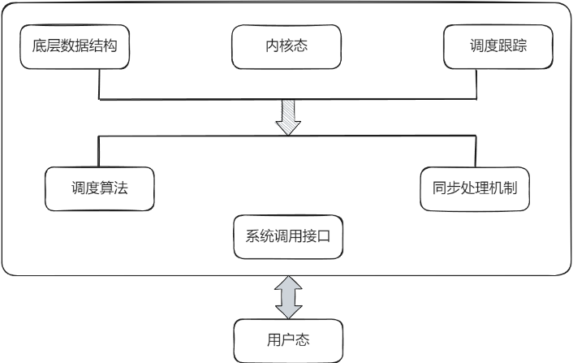

底层数据结构部分和调度跟踪部分是Yat-Sched支持部分。底层数据结构负责调度算法和同步处理机制数据结构的实现，调度跟踪部分使用Linux计数器负责调度信息记录的实现，为后续的性能测试提供数据信息支持。

调度算法部分和同步处理机制部分是Yat-Sched处理部分。调度算法部分包括调度算法（含面向资源的优先级排序算法）的实现，并整合为单独的模块存在于Yat-Sched中；同步处理机制部分将实现基于多核互斥资源共享协议的同步机制。

系统调用接口将提供多个系统调用供调度算法进行调用，用来编写实时任务程序。

在用户态，我们设计并实现了友好的用户交互体验，支持全面的任务参数设定，并支持以自定义csv数据文件提交实时作业。


### 系统测试情况

#### 考虑阻塞的任务分配机制性能测试

考虑以下竞争方法：（i）Worst-Fit、Best-Fit、First-Fit 和 Next-Fit heuristics 的组合作为基线（表示为 Any-Fit） (ii) 同步感知分区算法SPA； (iii) 我们实现的基于RCM的面向自旋锁的考虑阻塞的资源感知任务分配方法RAF。
我们采用MSRP的整体可调度性分析来评估系统的可调度性。对于每种参数配置，我们生成了1000个系统并对每种竞争方法进行了测试。测试结果如下面4图所示。

<table>
  <tr>
    <td>
      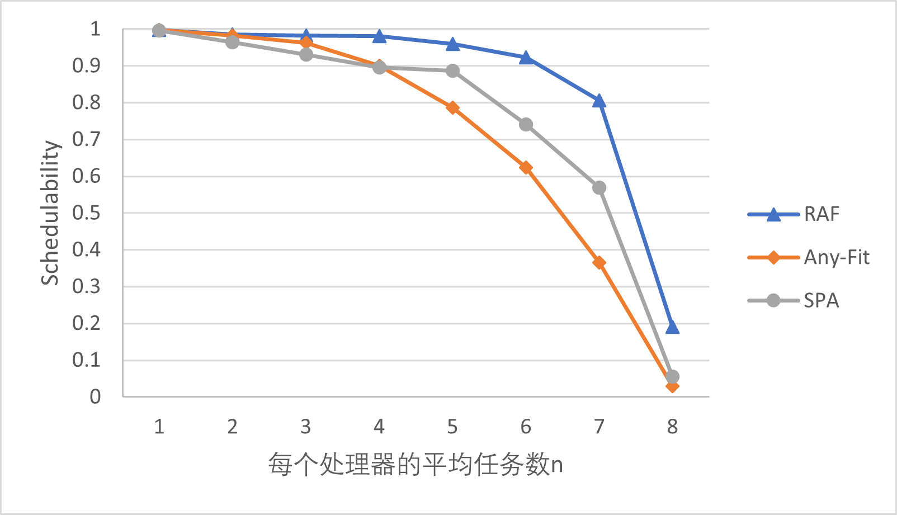
      <p style="text-align: center; font-weight: bold;">可调度性测试结果 m=12,N=24,L=[1μs,30μs]</p>
    </td>
    <td>
      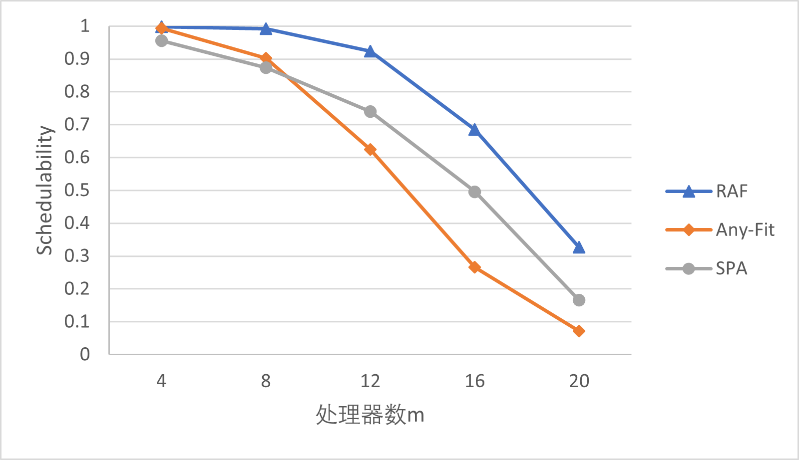
      <p style="text-align: center; font-weight: bold;">可调度性测试结果 n=6,N=24,L=[1μs,30μs]</p>
    </td>
  </tr>
  <tr>
    <td>
      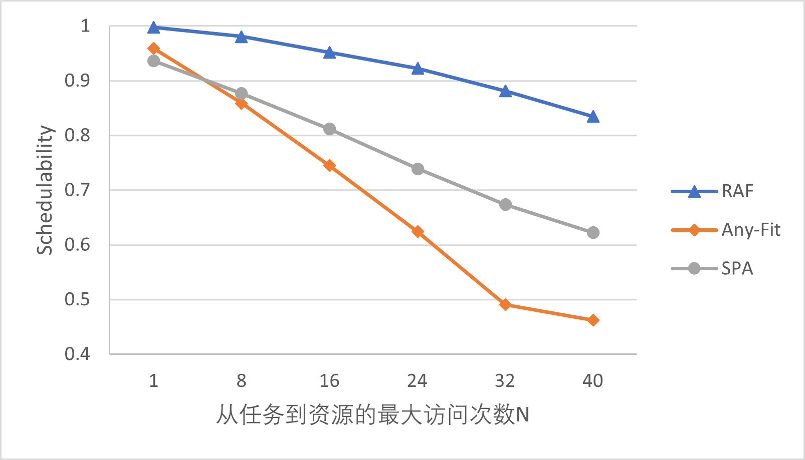
      <p style="text-align: center; font-weight: bold;">可调度性测试结果 n=6,m=12,L=[1μs,30μs]</p>
    </td>
    <td>
      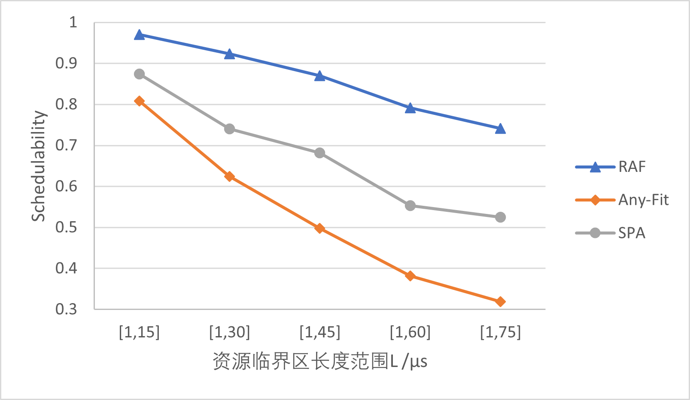
      <p style="text-align: center; font-weight: bold;">可调度性测试结果 n=6,m=12,N=24</p>
    </td>
  </tr>
</table>

上面4图分别给出了不同平均任务数n、处理器数m、最大访问次数N和临界区长度范围L下竞争方法系统的可调度性测试结果。当n=7时，我们的任务分配方法RAF比SPA高23.7%，比Any-Fit高44%。当处理器数m变化时，RAF平均比SPA高13.9%，比Any-Fit高21.4%。当最大访问次数N变化时，RAF最多可调度比SPA多21.3%、比Any-Fit多39%的系统。当临界区长度范围L=[1μs,60μs]时，RAF比SPA高23.9%，比Any-Fit高41%。

从测试结果可得，我们的任务分配方法RAF始终优于现有方法SPA和Any-Fit。相同的测试集下，RAF方法可以调度更多的系统。由于RAF和SPA都是基于系统的资源使用进行的，这验证了构建的RCM能够提供有效的指导，并验证了我们的任务分配方法RAF的有效性。


#### 面向资源的优先级排序算法测试

面向资源的优先级排序算法只是调度器的一个模块。由于是模块测试，我们使用的是单元测试的方法。因此本实验是仿真实验，在本地进行测试.实验设置与基于 ILP 的分析工作类似，涵盖了大部分的系统配置。

测试方法详见决赛文档。测试过程中我们设置不同的参数来模拟不同的硬件场景，并分别测试性能。对于一个场景，我们生成1000个系统任务集，分配运行DMPO,OPA,RPA和SPO算法，统计这些算法可调度的系统比例，并可视化。结果如下图所示，M为处理器数量，n为任务数，κ 指定每个处理器上可以访问资源的任务数（即 ⌊κ · n⌋），其中 κ ∈ [0.0,1.0]，每个个任务将向多个随机选择的资源发出请求，但选择资源的数量仅限于范围[1，M]，请求数量在[1，A]之间随机决定。

测试过程涉及*两个资源共享协议模型（MSRP和MrsP）*，由于*本项目使用的是MSRP共享协议*，所以测试的*重心是MSRP模型的测试*。MrsP的测试结果作为辅助测试，其作用是进一步说明SPO算法性能上的优势以及证明SPO算法的可扩展性（在不同的资源共享协议中性能都优于另外三个算法）。

<table>
  <td>
    
    <p style="text-align: center; font-weight: bold;">MSRP 系统的测试结果 M=8, n=32,κ=0.45, A=25,共享资源个数为M</p>
  </td>
</table>
<table>
   <td>
    
    <p style="text-align: center; font-weight: bold;">MSRP 系统的测试结果 M=12, n=36,κ=0.45, A=25,共享资源个数为M</p>
   </td>
</table>
<table>
  <td>
    
    <p style="text-align: center; font-weight: bold;">MrsP 系统的测试结果 M=8, n=32,κ=0.4, A=15,共享资源个数为M</p>
  </td>
</table>

从上述测试结果可知，在SPO调度算法下，可调度的系统数量都超过其他三个调度算法。这在不同的处理器数量，不同的任务数，不同的资源访问数，不同的临界区长度下效果都一致。相同的测试集下，SPO算法可以调度更多的测试系统。

为了让性能的比较更直观。我们还做了*横向对比*，将SPO算法与另外三个算法做横向比较。在横向比较中，我们统计了SPO可调度但DMPO不可调度、DMPO可调度但SPO不可调度、SPO可调度但OPA不可调度、OPA可调度但SPO不可调度、SPO可调度但RPA不可调度、RPA可调度但SPO不可调度的样例数量。总样例数为1000个。

下面几幅图为实验结果。!A&B表示A算法不可调度但是B算法可调度，A&!B表示A算法可调度但是B算法不可调度。为了表达上更加直观，我们用*百分比堆积图*的形式展示，下图*蓝色部分占比越多，说明SPO算法的优势越大*。条形上面标注的数字为这种样例的数量。

<table>
  <td>
    
    <p style="text-align: center; font-weight: bold;">MRSP 系统在 M=16, n=48,κ=0.4, 临界区长度L=[1,20]µs，共享资源个数为M情况下不同A的测试结果</p>
  </td>
</table>

<table>
  <td>
    
    <p style="text-align: center; font-weight: bold;">MRSP 系统在 M=16, n=48,κ=0.4, A=10,共享资源个数为M情况下不同临界区长度的测试结果</p>
  </td>
</table>

<table>
  <td>
    
    <p style="text-align: center; font-weight: bold;">MrsP 系统在 M=16, n=48,κ=0.25, 临界区长度L=[1,20]µs，共享资源个数为M的情况下不同A的测试结果</p>
  </td>
</table>

从上述结果看，无论临界区长度，A的值，资源访问数量如何变化，SPO算法对另外三个算法都有碾压性的优势，其他算法不可调度而SPO算法可调度的测例数量远大于SPO算法不可调度而其他算法可调度的测例数量。从这个结果可以看出SPO算法在可调度性上表现优异，性能优势显著。

*总结：*

在上述测试环节中，我们使用了大量不同的测例进行可调度性测试，从测试结果上看，SPO算法在各种测试中的表现都优于另外三个算法。因此，本项目使用SPO算法来提高调度器的性能是合理的。

#### 真机测试分析

我们要在真实的场景下做性能比较。我们将*我们的调度器*和*worst-fit+DMPO*的传统调度器进行比较，从而验证我们性能的提升。传统调度器中，使用worst-fit的任务分配机制以及DMPO的优先级排序算法。这两个方法也是目前最常用的方法。

这里我们主要采用业内知名的嵌入式系统和实时系统研究的基准测试套件 TACLE-Bench 在Linux内核环境下进行调度的性能测试。相关benchmark的源码可以从 https://github.com/tacle/tacle-bench 中获取得到。

我们主要从kernel benchmarks列表中选取了binarysearch(二分查找)、bsort(冒泡排序)、countnagative(统计负数)、fft(快速傅里叶变换)、matrix1(通用矩阵乘法)、insertsort(插入排序)、minver(矩阵转置)这7个benchmark。关于此的具体解释详见下表：

<table>
  <td>
    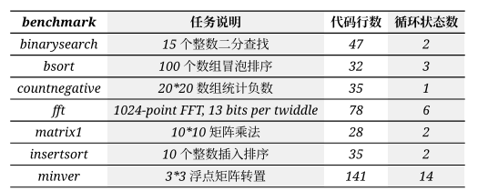
    <p style="text-align: center; font-weight: bold;">任务说明</p>
  </td>
</table>

进过不断的设计和改进我们最终每个线程执行的任务情况如下：

<table>
  <td>
    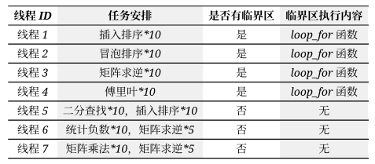
    <p style="text-align: center; font-weight: bold;">任务分配</p>
  </td>
</table>

执行结果：

我们可以通过st-job-stats工具来追踪每个任务的执行情况。它能生成一个csv文件，包括每个任务的执行参数。其参数描述如下：

<table>
  <td>
    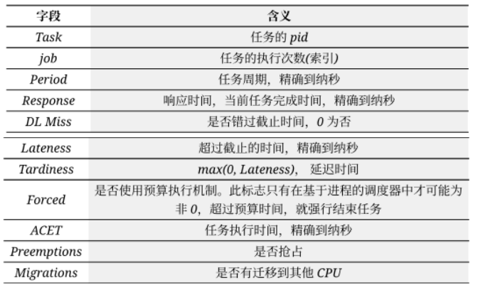
    <p style="text-align: center; font-weight: bold;">参数描述</p>
  </td>
</table>

通过分析csv的数据我们发现我们的方法比worst-fit+DMPO的方法有更优的执行时间和响应时间。尤其是执行时间，对于任务平均执行时间，我们的方法为4.46x$10^6$ ns,而worst-fit+DMPO的为4.50x$10^6$ ns。这意味着我们的调度器能支持更高的吞吐量，更少的资源消耗，以及更好的资源利用。具体原因可以看一下任务执行过程的可视化

<table>
  <td>
    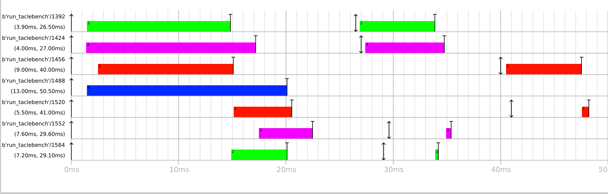
    <p style="text-align: center; font-weight: bold;">worst-fit+DMPO调度器的执行结果</p>
  </td>
</table>

<table>
  <td>
    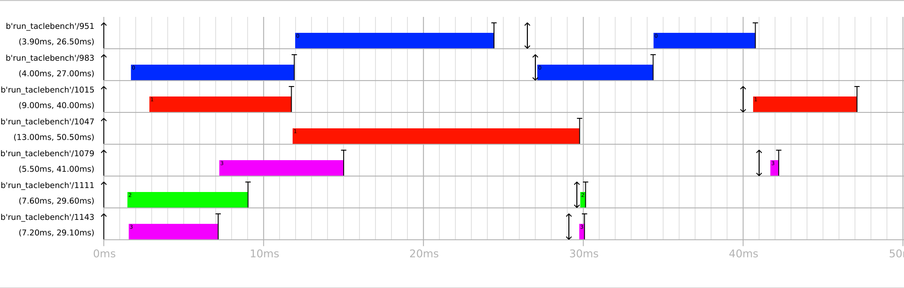
    <p style="text-align: center; font-weight: bold;">我们调度器的执行结果</p>
  </td>
</table>

从可视化图片可以看出worst-fit将4个有临界区的任务（线程1-4）分配到了4个核心上，而我们的方法将他们分为两组放到两个核心上。这极大减少了核间的资源竞争，从而降低了核间的阻塞。对于worst-fit的情况，由于每个核心都有一个有临界区的任务，所以他们都要等待互斥的共享资源，在忙等期间，线程在核心上自旋（spin），这导致了CPU资源的浪费，同时增加了1-4线程的执行时间。同时，DMPO算法未能像SPO算法一样考虑到自旋时间和任务到达阻塞造成的影响，没有临界区的任务没有分配到更高的优先级去抢占有临界区的线程，这使得执行时间较少的线程（5-7）被线程1-4阻塞了，即自旋线程后面的线程必须要等待核心最前面的线程自旋结束，拿到锁执行完后，才能开始执行。这不仅增加了响应时间，还会让这些不访问临界区的线程有很大的Miss deadline的风险。

在我们的调度器中，这些没有临界区的任务被集中分配到两个核心上，使得他们不受资源争用的影响，可以很明显的看出，5-7线程的响应时间显著减少。同时，我们的调度器把需要访问临界区的线程分为两组放到另外两个核心上，可以减少上述自旋的负面影响。不会出现4个线程都要访问临界区的情况。worst-fit+DMPO最坏情况下会有3个线程在等待临界区，而我们的方法最多一个。有效减少了线程的临界区等待时间，减少资源争用和任务阻塞，提升了整个系统的性能。

### 仓库目录和文件描述

```
/ (根目录)
├── README.md         # 简要介绍项目初赛完成情况
├── LICENSE           # 项目许可证
├── doc               # 存放一些前期调研、开发记录和其他一些杂记的文件夹
├── images            # 存放仓库需要用到的图片
├── src               # 存放项目源代码
│   ├── scripts       # 存放测试用的脚本源码
│   ├── wcet_test     # 存放用于在真机环境下测taclebench的wcet的代码
│   ├── yat_lib       # 存放yat_sched用户层执行调度器调用及任务测试的代码
│   └── yat_trace     # 存放用于调度器调度跟踪以及结果整理输出的代码
└── report            # 存放项目报告
```

### 相关资料调研

我们做了大量的调研，并做了一些简单的复现，具体文档如下(都放在了doc目录下)：

黄政菘：

- [实时系统概念](doc/hzs/rtos_learn.md)
- [论文调研](doc/hzs/dac23.md)
- [cfs调度器实现学习](doc/hzs/cfs.md)
- [litmus-rt框架学习](doc/hzs/litmus-rt_learn.md)
- [preempt-rt框架学习](doc/hzs/preempt-rt_learn.md)
- [diff&patch指令学习](doc/hzs/diffandpatch.md)
- [tmux指令学习](doc/hzs/tmux.md)

薛沐恩：

- [调研现有实时Linux系统](doc/rtlinux.md)
- [面向资源的优先级排序算法调研](doc/priority_assignment.md)

刘洋：

- [学习实时系统基本知识](doc/real-time_knowledge.md)
- [考虑阻塞的任务分配机制](doc/task_allocation.md)

[文献参考资料](doc/refs.md)


### 开发计划

初赛：

| **预期内容** | **预期时间** |
| - | - |
| 前期准备工作：组队、联系项目导师、往届参赛学长介绍参赛经验 | 4.19-4.25|
| 项目初步调研：可行性、实现方向、项目框架、技术栈，确定选题 | 4.26-5.2|
| 项目深度调研：复现已有项目代码、论文，初步弄懂实现逻辑，思考改进方式，深入调研Linux现有实时调度框架 | 5.3-5.9|
| 进行了第一次项目知识研讨，首次添加项目文件，标准化项目文档 | 5.10-5.16|
| 初步完成代码框架设计和试编译 | 5.17-5.23|
| 仓库建设，初赛资料准备，撰写初赛文档 | 5.24-5.30|

决赛第一阶段：

| **预期内容** | **预期时间** |
| - | - |
| 调度器整体跑通，能够运行简单的实时任务 | 6.9-6.15|
| 微调，在qemu跑测例，修bug | 6.16-6.22|
| 项目暂停，准备期末考、夏令营 | 6.23-7.15|
| 继续改进各模块，结果对比，写报告 | 7.16-7.23|
| 继续写报告、ppt、制作视频 | 7.24-7.31|

决赛第二阶段：

| **预期内容** | **预期时间** |
| - | - |
| 改进调度策略，修复项目bug | 8.1-8.7|
| 可调度性测试、功能测试、性能测试 | 8.8-8.14|
| 继续完善答辩材料，准备现场答辩 | 8.15-8.20|

### 分工和协作

| **小组成员** | **分工内容** |
| - | - |
| **黄政菘** | - 确定开发环境和初赛目标 |
| | - 确定项目整体架构并输出文档 |
| | - 调研PREEMPT_RT和Litmus-RT框架 |
| | - 整理问题问项目导师，和项目导师讨论实现细节 |
| | - 建立新的调度器，并实现自定义锁机制 |
| | - 设计多核互斥资源共享协议，定义接口算优先级和核心分配 |
| **薛沐恩** |     - 实现面向资源的优先级排序算法 |
| |   - 调研实时系统下的调度算法以及Linux中实时调度算法的实现，并输出文档 |
| |   - 调研DMPO、OPA、RPA等目前已有的优先级排序算法，并输出文档 |
| |   - 设计实时系统下的基于Slack的优先级排序算法（SPO） |
| |   - 复现前沿论文已有的实时系统下任务优先级排序算法，并输出文档 |
| **刘洋** |     - 实现考虑阻塞的任务分配机制 |
| | - 调研实时系统基本概念以及任务模型，并输出文档 |
| | - 设计实时系统下考虑资源访问顺序的任务分配机制（RAF） |
| | - 复现前沿论文已有的实时系统下任务分配机制，并输出文档 |

### 比赛过程中的重要进展

#### 初赛阶段：

1. 完成了项目的调研和整体规划，这也是我们在初赛的预期任务目标

2. 初步实现了Yat-Sched的框架部分

#### 决赛第一阶段：

1. 整体调通了调度器，并做了部分功能测试

2. 设计并实现了多核互斥资源共享协议MSRP

3. 设计并实现了面向资源的优先级排序算法SPO

4. 设计并实现了考虑阻塞的任务分配机制

#### 决赛第二阶段：

1. 完善了调度器运行自定义实时任务功能

2. 实现了多临界区调度功能

3. 完成了TACLeBench任务测试

### 比赛收获

感谢全国系统能力大赛组委会给我们提供这样一个宝贵的机会和平台，在一个半月初赛的过程中，虽然我们课余能投入到开发中的时间比较有限，但在此过程中我们还是有了不少的收获：

- **对Linux内核了解更深入了**：以前从没了解过Linux内部是使用什么调度机制使任务能并发高效运行的，直到接触到了proj291的开发，才从现有资料的调研直到Linux内部的5个调度类，以及他们作用的时机与过程。
- **学习到了不少实时系统方面的知识**：在接触这个项目之前我们队伍三人都没了解过实时系统，感谢赵帅老师给我们提供选择项目proj291的建议，并提供了多篇讲解主流实时系统领域技术研究的文章，使我们也能接触到这个之前从未探索过的领域。
- **开发技能得到提升**：从完整编译一个内核、打各种补丁开始，到从头到尾实现一个空调度器，再到使用gdb调试接口的可用性......以前我们很少接触像开发Linux内核这样大型的项目，此次的开发使我们对大型项目开发的工作流有了更进一步的认识与掌握。
- **抗压精神和团队合作精神得到提升**：因为Linux内核过于庞大，开发过程中如果稍有不慎就会导致编译Linux内核报各种各样的错，修复bug已经是家常便饭了，当一个人解决不了问题时，队伍三人齐心协力往往能使问题迎刃而解。

最后，再次感谢组委会及评审老师们！

**（本readme文件是一个速览，详情请看决赛文档）**

## 其他

### 许可证

本项目采用 MIT License 许可证。

### 联系我们

- 邮箱: huangzhs8@mail2.sysu.edu.cn

