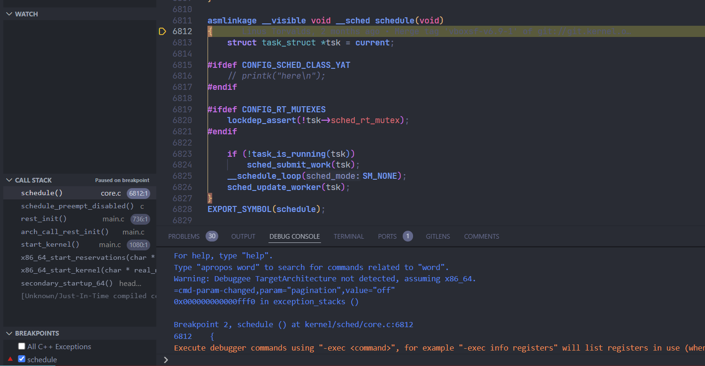

# Linux内核开发环境选择和搭建

## 项目环境

| **Linux发行版** | **Linux内核版本** | **环境目的** |
| - | - | - |
| Debian12.5 | 6.1.0-21-amd64 | 开发 |
| RaspBerry Pi OS | 6.6.31 | 性能测试 |


## 项目环境说明

在内核版本的选择上，因为根据前面的调研我们了解到，当前没有一款强有力的实时调度框架能够支持高版本的Linux内核，为了使我们开发的调度器能够作为补丁合入开源社区，同时也为了该调度器能够适配当前主流的内核技术，我们需要选择最新的内核版本，也即我们项目开始执行时最新的Linux Kernel 6.8版本。

在开发环境的选择上，Debian相较于Ubuntu具有更加轻量、稳定、简洁等优点，因此我们选择当前最新的Debian发行版12.5作为我们的开发环境。

在测试环境的选择上，因为我们当前可用的资源比较有限，所以只好使用校内导师能够提供的树莓派作为调度器的测试环境。


## 项目环境搭建概述

本小节介绍我们初赛环境配置的相关内容

**（1）下载安装debian 12.5**

在Debian官网https://www.debian.org/点击Download下载最新版的Debian虚拟机镜像，在VMware Workstation新建100G磁盘，4G内存的虚拟机，使用下载好的debian-12.5.0-amd64-netinst.iso镜像文件


启动虚拟机后选择Debian installer, 然后根据它的指引安装，设置本机名称为debian, root密码为root, user名为yat, 密码为yat, 其他均为默认即可。其中需要注意的是，在下载源的选择上需要选择国内的镜像源，否则会导致后续包的下载速度较慢。

将操作系统安装完，进入root用户登录，安装配置sudo：
```sh
su root
ll /etc/sudoers
chmod u+w /etc/sudoers
vim /etc/sudoers ...
chmod 440 /etc/sudoers
```

其中vim编辑sudoers文件的步骤中，需要在`root ALL=(ALL:ALL) ALL` 的行下面添加`yat ALL=(ALL:ALL) ALL` ，然后保存退出，此时再进入yat用户便可以使用sudo了。

**（2）安装必需的第三方软件包**

Debian默认自带的开发环境比较单一，无法支持我们本项目的开发，因此我们需要额外安装一些开发工具链，只需通过以下命令一键安装：
```sh
sudo apt update && apt upgrade
sudo apt install -y ssh vim git gcc curl zsh neofetch build-essential libncurses-dev flex bison libssl-dev libelf-dev dwarves qemu-system-x86 gdb
```

其中`ssh, vim, git, curl, zsh, neofetch` 等工具有助于更加高效便捷地进行开发，`gcc` 和`gdb` 是Linux环境下进行编译和调试必不可少的，剩下的`build-essential, libncurses-dev, flex, bison, libssl-dev, libelf-dev, dwarves, qemu-system-x86` 则是开发、编译、运行和调试Linux内核所必需的。

**（3）下载对应Linux内核源码**

在阿里云开源镜像站找到Linux 6.8内核的下载地址https://mirrors.aliyun.com/linux-kernel/v6.x/linux-6.8.tar.xz, 即内核6.8的源码，回到虚拟机中使用wget命令下载，下载完毕后使用`tar -xvf` 指令进行解压

**（4）更改配置选项，编译Linux内核**

进入解压后的Linux内核文件夹，执行`make menuconfig` 打开配置选项菜单


为了使得Linux内核能够最大限度地支持实时调度，我们需要更改一些默认的配置选项：
- **启用内核抢占**
  - 进入"General setup -> Preemption model"目录, 选择"`Preemptible Kernel (Low-Latency Desktop)`"
- **禁用群组调度**
  - 首先，进入"General setup", 禁用"`Automatic process group scheduling`", 然后在"General setup -> Control group support -> CPU controller"目录下, 禁用"`Group scheduling for SCHED_OTHER`"
- **禁用影响计时器频率的CPU频率缩放和一些电源管理选项**
  - 在General setup -> Timers subsystem -> Timer tick handling目录下，更改选项为"`constant rate, no dynticks`"
  - 在"Power management and ACPI options"目录下，禁用"`Suspend to RAM and standby`", "`Hibernation`"和"`Opportunistic sleep`"这三个选项
  - 在"Processor type and features"目录下禁用"`CPU Core priorities scheduler support`"选项，然后在"Power management and ACPI options -> CPU Frequency scaling"目录下，禁用"`CPU Frequency scaling`"

保存退出，然后执行`make bzImage -j 4 > log` 指令编译内核，整个过程会持续约10分钟。待编译完成后，进入arch/x86_64/boot目录，执行指令mkinitramfs -o initrd.img制作initrd镜像文件。至此，内核运行前的准备工作已完成。

**（5）搭建基于VSCode的内核调试环境**

本项目我们选择VSCode作为我们的代码编辑器。VSCode全称Visual Studio Code，是一款跨平台的、免费且开源的现代轻量级代码编辑器，支持几乎主流开发语言的语法高亮、智能代码补全、自定义快捷键、括号匹配和颜色区分、代码片段提示、代码对比等特性，也拥有对git的开箱即用的支持。同时，它还支持插件扩展，通过丰富的插件，用户能获得更多高效的功能。VSCode是当今主流的代码编辑平台，配置好VSCode能使我们内核开发的效率大幅提升。

首先打开PC端的VSCode, 点击左下角“打开远程窗口”，输入yat@192.168.88.128后按回车键，即可通过VSCode访问虚拟机上的文件及目录。

在vscode工作目录下创建.vscode/launch.json, 写入以下gdb配置内容并保存：
```sh
{
    "version": "0.2.0",
    "configurations": [
        {
            "name": "Kernel-Debug",
            "type": "cppdbg",
            "request": "launch",
            "miDebuggerServerAddress": "127.0.0.1:1234",
            "program": "${workspaceFolder}/Yat_kernel/vmlinux",
            "args": [],
            "stopAtEntry": false,
            "cwd": "${workspaceFolder}",
            "environment": [],
            "externalConsole": false,
            "logging": {
                "engineLogging": false
            },
            "MIMode": "gdb",
        }
    ]
}
```

回到虚拟机命令行界面（也可以通过VSCode窗口下方的命令行窗口操作虚拟机系统）进入arch/x86_64/boot目录并执行`qemu-system-x86_64 -kernel bzImage -initrd initrd.img -append nokaslr -m 1G -S -s` , 启动qemu调试内核。

然后在VSCode左侧栏找到“Run and Debug”，在最后的“BREAKPOINTS”处手动添加断点"schedule", 然后按F5运行，即可发现下图所示内核的启动成功在schedule函数下断住了，之后我们便可以通过VSCode自带的单步跳过（F10）和单步步入（F11）等调试按钮进行方便的调试了，并且左侧栏也可以显示当前断点的相关变量值以及堆栈信息。



至此，基于VSCode的Linux内核开发环境已搭建完毕。

**（6）（可选）配置VSCode的clangd插件，方便阅读代码**

Microsoft官方的C++插件虽说能满足平常的代码高亮和定义跳转需求，但面对Linux内核这样的大型项目还是会显得有些卡顿，将鼠标移到函数上方常常需要等待几秒钟才显示函数的定义，更别说跳转到定义了。这极大影响了我们开发的效率。

因此我们通过配置基于LLVM的clangd插件，极大地改善了代码阅读效率。

因为该部分不是我们环境配置的重点，这里就不过多阐述了，具体的配置步骤可以参考网上相关的教程（如https://blog.csdn.net/ludaoyi88/article/details/135051470）
