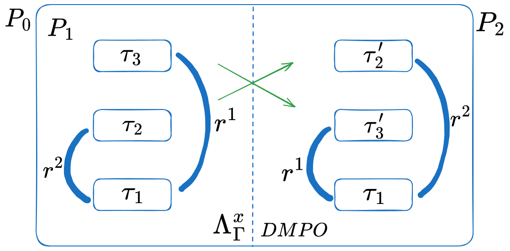
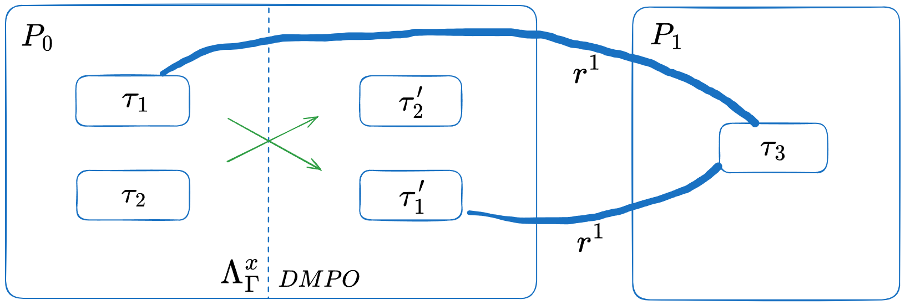
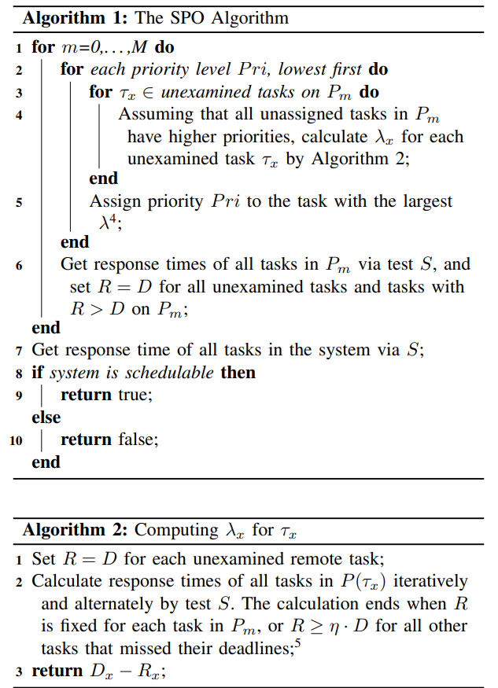
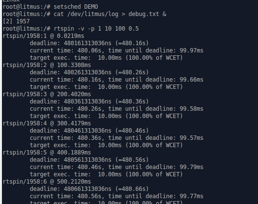

# 面向资源的优先级排序算法介绍

目前已有的优先级排序算法的简单介绍：
首先介绍3个主流的任务优先级排序算法——DMPO, OPA 和 RPA

1. *DMPO算法*

DMPO算法为deadline越短的任务分配更高的优先级。即当#m-jaxon.render("Deadline_x", inline: true)<#m-jaxon.render("Deadline_y", inline: true)则#m-jaxon.render("Priority_x", inline: true)>#m-jaxon.render("Priority_y", inline: true)，通过这个规则实现对任务的优先级排序。

2. *OPA算法*

给定一组未分配优先级的任务，该算法从最低优先级开始，检查是否存在可在该优先级上调度的未分配优先级的任务(此时假设所有其他未分配的任务具有更高的优先级)。如果找到这样的任务，则为其分配此优先级。然后算法进入下一个优先级并检查其余未分配的任务。如果为每个任务分配了优先级，则该算法将返回可调度的解决方案。 OPA 是一种最佳优先级分配，因为它保证可以找到可调度的优先级排序（如果有），最坏情况为 n(n + 1)/2 次迭代。此外，OPA 被证明比 DMPO 对于更广泛的应用程序语义来说是最佳的，例如具有偏移发布时间的系统和不确定deadline等情况。

*OPA算法伪代码：*
```c
Procedure OptimalPriorityAssignment(tasks)
    Initialize priority to 1
    Initialize an empty list assigned_tasks

    While tasks are not empty
        current_priority = priority
        CanSchedule = false

        For each task in tasks
            If task can be scheduled at current_priority
                // Assume all other unassigned tasks have higher priority
                assigned_tasks.append(task)
                Remove task from tasks
                CanSchedule = true
                Break // Exit the loop if a task is scheduled at this priority

        if CanSchedule == false
            Break // No task can be scheduled, exit the loop

        priority = priority + 1 // Move to the next priority level

    If assigned_tasks contains all tasks
        Return assigned_tasks // All tasks are assigned and schedulable
    Else
        Return "No schedulable solution found" // Not all tasks could be scheduled
EndProcedure
```


3. *RPA算法* @davis2007robust

在OPA算法执行的时候，如果给定优先级存在多个可调度任务，则任务会被分配任意优先级。这可能会导致系统只是可调度的，但容易受到任务参数微小变化、执行预算超支或低估干扰的影响。为了解决这个问题，RPA 被开发为 OPA 的扩展，并采用一种方法来指定应在每个优先级分配的确切任务。在 RPA 中，引入了干扰函数来对任务在每个优先级上可能产生的潜在干扰量进行建模，同时保持可调度性。通过此功能，RPA 旨在产生可以容忍最大量额外干扰的优先级排序。
与OPA类似，RPA从最低优先级开始，需要n(n+1)/2次二分搜索来找到所有优先级的最大附加干扰。在给定的优先级上，可以容忍最大量额外干扰的任务将被分配该优先级。然后该算法迭代到下一个优先级，直到所有任务都被分配了优先级。如果能够找到可行的优先级排序，则保证该系统是可调度的，并且能够应对所有优先级中可容忍的最小附加干扰

*RPA算法的伪代码：*
```c
Procedure OptimalPriorityAssignment(tasks)
    Initialize priority to 1
    Initialize an empty list assigned_tasks

    While tasks are not empty

        For each task in tasks
            binary search for the largest value of α for which task τ is schedulable  at priority i

        if no tasks are schedulable at priority i
           return unschedulable
        else
           assign the schedulable task that tolerates the max α at priority i to  priority i

        priority = priority + 1 // Move to the next priority level

    If assigned_tasks contains all tasks
        Return assigned_tasks // All tasks are assigned and schedulable
    Else
        Return "No schedulable solution found" // Not all tasks could be scheduled
EndProcedure
```

*本项目最终实现的优先级排序算法*

上述三个算法在holistic schedule的情况下会出现问题。

在“面向资源的优先级排序算法设计”这一部分中我们会用具体的例子论证：运行holistic schedulability tests时，在fully partitioned的多处理器约束截止系统中，共享资源由 MSRP 或 MrsP 管理时DMPO 不是optimal的。

同时我们发现在执行holistic schedule的时候，如果不知道本地高优先级任务和共享相同资源的远程任务的响应时间，就不可能获得给定任务的准确响应时间。这会导致OPA和RPA算法出现问题。

原因：OPA和RPA算法在确定某个task是否可调度的时候，需要计算出这个任务的确切响应时间（R）,但是这在holistic schedule下做不到。任何一个任务的响应时间的计算都需要知道其他相关任务的响应时间。OPA类的算法试图获得固定的响应时间的时候假设所有未检查的任务（即尚未分配优先级的任务）具有更高的优先级，但不假设这些任务有任何确切的优先级顺序。然而，对于 holistic tests,系统中任务的响应时间必须迭代计算，直到所有任务的响应时间都固定下来，并具有明确的任务优先级（假设系统是可调度的）。 而对于最初的 OPA 和 RPA算法，在holistic
schedulability tests下，因为每个任务无法知道本地高优先级任务和共享相同资源的远程任务的响应时间，所以它们不可能获得给定任务的确切响应时间。这会导致优先级排序算法在执行过程中出现问题。

一种解决方法是直接令响应时间=Deadline时间，即$R_x$=$D_x$,下文中我们将这种方法称为 OPA-D 和 RPA-D算法。然而，这种方法的问题是，通过用 $D_x$ 替换 $R_x$，在可调度系统中，由于 $R_x$ ≤ $D_x$，对可调度性结果会产生相当大的pessimism,这可能会导致实际上可行的系统无法调度。此外，由于必须对可调度性测试做出妥协，这些优先级排序算法的最优性也可能受到损害。

基于以上考虑本项目实现了一种新的优先级排序算法，即*基于 Slack 的优先级排序 (SPO)*,SPO 与 OPA 类算法有着类似的理念，后者检查每个优先级（从最低优先级开始），并从所有未检查的任务（即未分配优先级的任务）中为任务分配优先级。然而，与 OPA 类算法不同，SPO 引入了响应时间近似方法，以尽量减少由于在整体可调度性测试中使用而产生的pessimism 影响。本质上，SPO 考虑了响应时间依赖性，旨在尽量减少具有这种依赖性的响应时间计算中的pessimism影响。

与OPA-D和RPA-D在计算给定任务$τ_i$的$R_i$时简单地假设其他所有任务的R=D相比，SPO在迭代过程中逐渐取代了对达到响应时间固定点的任务的悲观上限，这将在下文中详细解释。因此，SPO通常比OPA-D和RPA-D得到更准确的响应时间。此外，在计算$R_i$时，SPO以整体方式计算$τ_i$处理器上所有任务的响应时间（将会在设计和实现部分详细介绍）。这种方法完全避免了$τ_i$与其局部高优先级任务之间的响应时间依赖性导致的pessimism影响。相比之下，在OPA-D和RPA-D中，这种pessimism存在于整个优先级分配过程中。

# 面向资源的优先级排序算法设计

1. *响应时间建模*

*A. 在Traditional Schedulability Tests下的模型*

在 MSRP 和 MrsP 协议下，给定任务 $τ_i$ 的响应时间 $R_i$ 由@eg:pr1 计算。$macron(C_i)$,是  $τ_i$ 的总计算时间(包括  $τ_i$ （旋转）等待和执行每个请求资源的时间)。$B_i$ 表示  $τ_i$ 到达时可能产生的阻塞量。函数 lhp(i) 返回一组优先级高于  $τ_i$ 优先级的本地任务。此外，$T_h$ 是 $τ_h$ 的周期，$C_h$ 是 $τ_h$ 的总计算时间（与 $C_i$ 的原理相同）。

#mitex(`
R_i=\overline{C_i}+B_i+\sum_{\tau_h\in\mathbf{lhp}(i)}\biggl[\frac{R_i}{T_h}\biggr]\overline{C_h}
`) <eg:pr1>


符号 $macron(C_i)$由@eg:pr2 确定。函数 $ sum_(r^k in F(tau_i)) N_i^k e^k$表示 $τ_i$ 在一次发布中等待和执行每个请求资源（通过 F($τ_i$) 算出）所花费的总时间，其中 $N_i^k$ 是 $τ_i$ 在一次发布中请求资源$r_k$ 的次数，$e^k$ 是$r_k$的最坏情况访问时间。

#mitex(`
\overline{C_i}=C_i+\sum_{r^k\in F(\tau_i)}N_i^ke^k
`) <eg:pr2>


由于 MSRP 下对资源的请求是按照非抢占式 FIFO 顺序提供的，因此 $e_k$ 实际上受包含对 $r_k$ 的请求的处理器数量的限制，如@eg:pr3 所示，其中 G($r_k$)表示需要r_k的任务集，$c_k$ 表示使用 $r_k$ 执行的最坏情况成本，函数 map() 返回分配了给定任务的处理器集合，| · | 返回给定集合的大小。对于 MrsP,虽然它采用了抢占式资源访问方式，但在最坏情况下，一项任务会先代表 FIFO 队列中的所有其他任务执行，然后才能使用该资源（有关 MrsP 的帮助机制，请参阅 @burns2013schedulability）。因此，MrsP 任务可能产生的最坏情况阻塞时间也由@eg:pr3 计算，如 @burns2013schedulability 中所述。

#mitex(`
e^k=|map(G(r^k))|*c^k
`) <eg:pr3>

$τ_i$ 的到达阻塞 ($B_i$) 通过@eg:pr4 和@eg:pr5 计算，其中 $hat(e_i)$ 是 $τ_i$ 可能因远程延迟而产生的到达阻塞，$hat(b)$ 是底层操作系统中的最大非抢占部分，$F^A (τ_i)$ 返回可能导致 $τ_i$ 在到达时产生阻塞的资源集。

#mitex(`
B_i=max\{\hat{e_i},\hat{b}\}
`) <eg:pr4>

#mitex(`
\hat{e}_i=max\{e^k|r^k\in F^A(\tau_i)\}
`) <eg:pr5>

然而，由于 MSRP 和 MrsP 使用不同的优先级来访问全局共享资源（即非抢占和优先级上限），因此在这些协议下计算此类资源的方法是不同的。

对于MSRP,如果全局资源 $r_k$ 被 $τ_i$ 的本地低优先级任务（记为 #m-jaxon.render("τ_{ll}", inline: true)）请求，则 $r_k$ 可能导致 $τ_i$ 发生到达阻塞。对于本地资源，PCP @sha1990priority 被强制执行，因此如果资源的优先级上限高于 pri($τ_i$) 且被 #m-jaxon.render("τ_{ll}", inline: true) 请求，则该资源可能导致此类阻塞。@eg:pr6 给出了在 MSRP 下可能导致到达阻塞的资源集(记为 $F^A_† (τ_i)$),其中 #m-jaxon.render("N^k_{ll}", inline: true) 给出一次发布中从 #m-jaxon.render("τ_{ll}", inline: true)到 $r_k$ 的请求数。

#mitex(`
F_{\dagger}^{A}(\tau_{i})=\{r^{k}|N_{ll}^{k}>0\wedge(r^{k}\text{is global}\vee pri(r^{k})\geq pri(\tau_{i}))\}
`) <eg:pr6>


对于 MrsP 来说，由于本地和全局资源都以上限优先级进行访问，因此 $F^A_‡ (τ_i)$ 的限制很简单，只需找到在 P($τ_i$)（即 $τ_i$ 的host processor）上具有比 pri($τ_i$) 更高的上限且由  #m-jaxon.render("τ_{ll}", inline: true) 请求的资源即可，如@eg:pr7 所示。

#mitex(`
F_{\ddagger}^A(\tau_i)=\{r^k|N_{ll}^k>0\wedge pri(r^k,P(\tau_i))\geq pri(\tau_i)\}
`) <eg:pr7>


*B.在Holistic Schedulability Tests下的模型*

尽管上述Traditional Schedulability Tests有诸多优点，但是这些测试依赖于这样的假设：每次一个任务（用 $τ_i$ 表示）请求资源时，map(G($r_k$)) 中每个远程处理器上总会有一个远程请求可以阻塞 $τ_i$ ，而不管在时间段 $R_i$ 内可以发出的实际可能请求数量。此外，如 @wieder2013spin 所述，这些测试依赖于阻塞时间相对于任务执行时间的膨胀，这引入了额外的pessimism影响。随后，@brandenburg2011scheduling 提出了一种基于整数线性规划的针对几种自旋锁协议（包括 MSRP）的改进可调度性测试。后来，@zhao2017new 重新格式化了基于 ILP 的分析以消除任何优化的需要，并在 MrsP 的背景下提出了一种整体可调度性测试，它分析了给定时间段内可以发出的资源请求总数。这种整体分析可以直接应用于 MSRP 和 MrsP,并采用相应的 $F^A (τ_i)$ 函数(即@eg:pr6 和 @eg:pr7）

在 @zhao2017new 的整体分析中，$τ_i$ 的响应时间由@eg:pr8 限定，其中 $C_i$ 是 $τ_i$ 的纯最坏情况计算时间（即不访问任何共享资源），$E_i$ 是 $τ_i$ 的总资源访问时间，其中考虑了潜在的自旋延迟和来自每个本地高优先级任务 $τ_h$（它抢占了 $τ_i$，但因请求锁定的资源而被阻止）导致的 τi 产生的间接自旋延迟（即传递阻塞），$B_i$ 是 $τ_i$ 的到达阻塞。

#mitex(`
R_i=C_i+E_i+B_i+\sum_{\tau_h\in\mathbf{lph}(i)}\lceil\frac{R_i}{T_h}\rceil\cdot C_h
`) <eg:pr8>

$E_i$ 通过@eg:pr9 得出，其中 $ζ^k_i$ 表示 $τ_i$ 的本地高优先级任务向 $r_k$ 发出的总请求数，$ξ^k_i$,m 表示远程处理器 $P_m$ 向 $r_k$ 发出的请求数。请注意，此分析使用整体方法限制阻塞时间，其中在 $τ_i$ 发布期间由于 $r_k$ 而导致 $τ_i$ 从远程处理器 $P_m$ 可能产生的最大阻塞由 $N^k_i$ +$ζ^k_i$（$R_i$ 持续时间内 $τ_i$ 及其本地高优先级任务向 $r_k$ 发出的总请求数）和  #m-jaxon.render("ξ^k_{i,m}", inline: true) 之间的最小值限制。通过这样做，此分析不像传统测试那样pessimism, 因为:

*1）*它计算出了可能导致阻塞的*确切*远程请求数量（即避免了Traditional Schedulability Tests中使用的假设）

*2）*每个关键部分（即资源请求）只考虑一次（避免增加任务的计算时间）

#mitex(`
E_i=\sum_{r^k\in\mathbb{R}}(N_i^k+\zeta_i^k+\sum_{P_m\neq P(\tau_i)}\min\{N_i^k+\zeta_i^k,\xi_{i,m}^k\})\times c^k
`) <eg:pr9>


$ζ^k_i$ 和 #m-jaxon.render("ξ^k_{i,m}", inline: true) 分别由@eg:pr10 和@eg:pr11 得出。如方程所示，它们包含一个抖动间隔（即分别为 $R_h$ 和 $R_j$），以延长 $τ_i$ 的释放持续时间，从而提供安全的上限。如 @brandenburg2011scheduling 中所述和证明的（参见 @brandenburg2011scheduling 中的引理 5.1），在多处理器系统中，在给定的持续时间 t 内，最多可以释放  #mi(`\left\lceil\frac{t+R_x}{T_x}\right\rceil`)  作业。该引理构成了计算给定持续时间内发出的请求数的基本方法，并被 @wieder2013spin@zhao2017new@zhao2018fifo 中改进的可调度性测试所应用。

#mitex(`
\zeta_i^k=\sum_{\tau_h\in\mathbf{lph}(i)}\left\lceil\frac{R_i+R_h}{T_h}\right\rceil N_h^k
`) <eg:pr10>

#mitex(`
\xi_{i,m}^k=\sum_{\tau_j\in\Gamma_{P_m}}\lceil\frac{R_i+R_j}{T_j}\rceil N_j^k
`) <eg:pr11>


$τ_i$ 的到达阻塞 ($B_i$)（在公式 8 中）通过@eg:pr4 计算，但采用不同的边界方法，如@eg:pr12 和 @eg:pr13 中所示。

#mitex(`
\hat{e_i}=max\{|\alpha_i^k|\cdot c^k|r^k\in F^A(\tau_i)\}
`) <eg:pr12>


其中 $α^k_i$ 表示包含未计入 $r_k$ 的请求（即未在 $E_i$ 中考虑的请求）的处理器集，其计算方式如下：

#mitex(`
\alpha_i^k\triangleq\{P_m|\xi_{i,m}^k-\zeta_i^k-N_i^k>0\wedge P_m\neq P(\tau_i)\}\cup P(\tau_i)
`) <eg:pr13>

#fake-par

对于属于 $F^A(τ_i)$ 的每个 $r_k$，该方程确定包含未计入请求的远程处理器（即 #m-jaxon.render("ξ^k_{i,m}", inline: true)  − $ζ^k_i$ − $N^k_i$ > 0），其中每个处理器中对 $r_k$ 的请求在到达时都会阻塞 $τ_i$。因此，通过限制此类处理器的数量，@eg:pr12 得出 $τ_i$ 在 $F^A (τ_i)$ 中的所有资源中可能产生的最大阻塞

*2. 最优性(optimal)分析*

#figure(
  table(
    columns: 3,
    // inset: 10pt,
    align: center,
    [*协议*],[*传统测试*],[*Holistic测试*],
    [MSRP(#mi(`\dagger`))],[#mi(`S_{\dagger}`)],[#mi(`S_{\dagger}^{\diamond}`)],
    [MrsP(#mi(`\ddagger`))],[#mi(`S_{\ddagger}`)],[#mi(`S_{\ddagger}^{\diamond}`)],
  ),
  caption: [MSRP和MrsP的可调度性测试],
) <tab:sc>

定义 1： 优先级分配算法 Λ 在任务模型、调度算法 G 和可调度性测试 S 下是最优的，当且仅当符合任务模型的每一组任务在其他优先级分配下被 S 视为可使用 G 调度，也可使用 Λ 调度。

可以用数学归纳法证明DMPO在Traditional Schedulability Tests下是optimal的，具体可见@zhao2021priority

归纳基：假设优先级分配算法 $Λ_x$ 在可调度性测试 $S_†$ 或 $S_‡$ 下可使用 M 个处理器对给定任务集 Γ 进行调度，其中 $Λ^x_Γ$ 表示任务集 Γ 的可调度优先级顺序。

归纳步骤：在 $Λ^x_Γ$ 下，选择一对不按 DMPO 顺序排列的相邻任务，交换它们的优先级以形成新的优先级排序，记为 #m-jaxon.render("\Lambda_{\Gamma}^{x-1}",inline:true) 。然后，证明没有任务因为这种优先级交换而错过截止时间。对于具有 n 个任务的任务集，最多需要 x = n(n + 1)/2 次优先级交换才能将一个处理器中的优先级排序从 $Λ^x_Γ$ 转移到 DMPO（即 $Λ^1_Γ$ = DMP$O_Γ$）。如果在所有处理器的整个优先级重新排序过程中，没有任务分别在 $S_†$ 和 $S_‡$ 下错过截止时间，则将不存在可用 $Λ^x_Γ$ 调度但不能用 DMPO 调度的任务集，从而证明了 DMPO 的最优性

但是在holistic schedulability test下：在 $S^⋄_†$（MSRP）或 $S^⋄_‡$（MrsP）下由 MSRP 或 MrsP 管理共享资源的fully partitioned多处理器约束截止系统中，DMPO 不是最优的。

证明:本证明通过反例进行。图 4.4 显示了具有两个共享资源 $r^1$ 和 $r^2$ 的三处理器系统。表 4.3和4.4 给出了处理器 $P_1$ 中的任务属性和资源使用情况。在 $τ_2$ 和 $τ_3$ 之间执行优先级交换。在优先级排序 $W^x$ 下，pri($τ_3$) > pri($τ_2$) > pri($τ_1$)，且 $D_3$ > $D_2$，即截止时间较长的任务被分配更高的优先级。在 DMPO 下，pri($τ_2$) > pri($τ_3$) > pri($τ_1$)，因此优先级按截止时间的相反顺序分配。此外，我们假设 $P_0$ 和 $P_2$ 都对 $r^1$ 和 $r^2$ 有足够的请求，因此从 $P_1$ 访问 $r^1$（或 $r^2$ ）的成本始终为 3$c^1$（或 3$c^2$ ）



#figure(
  table(
    columns: 4,
    // inset: 10pt,
    align: center,
    [*Task(#mi(`\tau_x`))*],[*#mi(`C_x`)*],[*#mi(`T_x`)*],[*#mi(`D_x`)*],
    [#mi(`\tau_2`)],[1],[17],[17],
    [#mi(`\tau_3`)],[1],[27],[27],
  ),
  caption: [上图系统的P1中任务属性],
) <tab:p1t>

#figure(
  table(
    columns: 4,
    // inset: 10pt,
    align: center,
    [*Resource(#mi(`r^k`))*],[*#mi(`c^k`)*],[*#mi(`G(r^k)`)*],[*#mi(`N_x^k`)*],
    [#mi(`r^1`)],[1],[#mi(`\{\tau_1,\tau_3\}`)],[#mi(`N_1^1=1,N_3^1=1`)],
    [#mi(`r^2`)],[2],[#mi(`\{\tau_1,\tau_2\}`)],[#mi(`N_1^2=1,N_2^2=1`)],
  ),
  caption: [上图系统的P1中资源使用情况],
) <tab:p1r>

在 MSRP 下，由于采用非抢占式资源访问方法，$r^1$ 和 $r^2$ 都可能导致 $τ_2$ 和 $τ_3$ 在两种优先级排序中出现到达阻塞，因此在 $Λ^x_Γ$ 和 DMPO 中 $F^A (τ_2)$ = $F^A (τ_3)$ = {$r^1$ , $r^2$}。优先级排序 $Λ^x_Γ$ 下 $τ_3$ 和 $τ_2$ 的响应时间计算如下所示。

#mi(`
\begin{aligned}
R_{3}=& C_{3}+E_{3}+B_{3}  \\
\text{=}& C_{3}+3c^{1}+max\{3c^{1},3c^{2}\}  \\
=& 1+3\times1+3\times2  \\
=& \text{10}  \\
R_{2}=& C_{2}+E_{2}+B_{2}+\left\lceil\frac{R_{2}}{T_{3}}\right\rceil C_{3}  \\
=& C_{2}+3c^{2}+max\{3c^{1},3c^{2}\}+\left\lceil{\frac{R_{2}}{T_{3}}}\right\rceil C_{3}+\left\lceil{\frac{R_{2}+R_{3}}{T_{3}}}\right\rceil3c^{1}  \\
=& 1+3\times2+3\times2+\left\lceil{\frac{R_{2}}{27}}\right\rceil\times1+\left\lceil{\frac{R_{2}+10}{27}}\right\rceil\times3  \\
=&\text{17}
\end{aligned}
`)

从以上计算中，我们可以看出，在优先级交换之前，两个任务都能够满足截止期限。然而，在优先级交换之后，$R′_3$ 却错过了截止期限，如下所示。

#mi(`
\begin{aligned}
R_{2}^{\prime}=& C_{2}+E_{2}+B_{2}  \\
\text{=}& C_{2}+3c^{2}+max\{3c^{1},3c^{2}\}  \\
=&   1+3\times2+3\times2  \\
=& \text{13}  \\
R_{3}^{\prime}=& C_{3}+E_{3}+B_{3}+\left\lceil\frac{R_{3}^{\prime}}{T_{2}}\right\rceil C_{2}  \\
=& C_{3}+3c^{1}+max\{3c^{1},3c^{2}\}+\left\lceil\frac{R_{3}^{\prime}}{T_{2}}\right\rceil C_{2}+\left\lceil\frac{R_{3}^{\prime}+13}{17}\right\rceil3c^{2}  \\
=& 1+3\times1+3\times2+\left\lceil\frac{R_{3}^{\prime}}{17}\right\rceil\times1+\left\lceil\frac{R_{3}^{\prime}+13}{17}\right\rceil\times(3\times2) \\
= &\text{30}
\end{aligned}
`)

使用 MrsP 的整体测试（即 $S^⋄_‡$ ），情况类似，但响应时间值不同。根据此协议（使用优先级上限），在$Λ^x_Γ$ 下$F^A_‡ (τ_3)$ = {$r_1$}优先级交换后，$F^A_‡ (τ_2)$ = {$r_2$}。然而，这并没有改变交换前两个任务都是可调度的事实原来（$R_3$ = 7,$R_2$ = 17），但 $τ_3$ 在优先级降低后错过了截止时间（$R′_2$ = 13 和 $R′_3$ = 30）

基于上述反例，我们证明 DMPO 在整体测试下并不是optimal的，因为方程 (10) 中存在响应时间依赖性，这是为了减少对膨胀任务执行时间的pessimism而引入的。

但是，上述计算都是假设每次访问 $r_k$ 的成本为 |map(G($r_k$ ))|。下面我们提供另一个例子，说明 DMPO 的最优性也会由于远程任务的响应时间依赖性而受到破坏（在公式 (11) 中），该例子用于最小化在计算访问共享资源的成本时使用常数上限所带来的悲观情绪。图 4.5 展示了一个双处理器系统，其中有三个任务和一个由两个处理器共享的资源 ($r^1$ )。表 4.5和4.6 给出了该系统的任务参数和资源使用情况。在 $P_0$ 上对 $τ_1$ 和 $τ_2$ 进行优先级交换，如图 4.5 所示。在此示例中，优先级交换之前 pri($τ_1$) > pri($τ_2$)，而交换之后 pri($τ_2$) > pri($τ_1$)。



#figure(
  table(
    columns: 5,
    // inset: 10pt,
    align: center,
    [*Task(#mi(`\tau_x`))*],[*#mi(`P_x`)*],[*#mi(`C_x`)*],[*#mi(`T_x`)*],[*#mi(`D_x`)*],
    [#mi(`\tau_1`)],[0],[2],[28],[28],
    [#mi(`\tau_2`)],[0],[5],[20],[20],
    [#mi(`\tau_3`)],[1],[3],[35],[20],
  ),
  caption: [上图系统的任务属性],
) <tab:p2t>

#figure(
  table(
    columns: 4,
    // inset: 10pt,
    align: center,
    [*Resource(#mi(`r^k`))*],[*#mi(`c^k`)*],[*#mi(`G(r^k)`)*],[*#mi(`N_x^k`)*],
    [#mi(`r^1`)],[4],[#mi(`\{\tau_1,\tau_3\}`)],[#mi(`N_1^1=1,N_3^1=3`)],
  ),
  caption: [上图系统的资源使用情况],
) <tab:p2r>

在 $Λ^x_Γ$ 下，无论应用 MSRP 还是 MrsP，任何任务都不会发生到达阻塞（即，所有任务的 $hat(e)$ = 0），因为只有 $τ_1$ 和 $τ_3$ 请求 $r^1$ 。因此，在 $S^⋄_†$ 和 $S^⋄_‡$ 下，所有三个任务的响应时间都相同，并且所有任务都能够满足其截止期限，如下所示

#fake-par

#mi(`
\begin{aligned}
R_{1}=& C_1+E_1  \\
&= C_{1}+N_{1}^{1}c^{1}+\operatorname*{min}\{N_{1}^{1}c^{1},\left\lceil\frac{R_{1}+R_{3}}{T_{3}}\right\rceil N_{3}^{1}c^{1}\}  \\
&= 2+4+\operatorname*{min}\{4,\left\lceil{\frac{R_{1}+18}{35}}\right\rceil\times12\}  \\
&\text{=} \text{10}  \\
R_{2}=& C_{2}+E_{2}+\left\lceil{\frac{R_{2}}{T_{1}}}\right\rceil C_{1}  \\
= & C_{2}+\operatorname*{min}\{\left\lceil{\frac{R_{2}+R_{1}}{T_{1}}}\right\rceil N_{1}^{1}c^{1},\left\lceil{\frac{R_{2}+R_{3}}{T_{3}}}\right\rceil N_{3}^{1}c^{1}\}  \\
&+\left\lceil\frac{R_{2}+R_{1}}{T_{1}}\right\rceil N_{1}^{1}c^{1}+\left\lceil\frac{R_{2}}{T_{1}}\right\rceil C_{1} \\
= &5+\operatorname*{min}\{\left\lceil{\frac{R_{2}+10}{28}}\right\rceil4,\left\lceil{\frac{R_{2}+18}{35}}\right\rceil12\}+\left\lceil{\frac{R_{2}+10}{28}}\right\rceil4  \\
&+\left\lceil\frac{R_{2}}{28}\right\rceil\times2 \\
& =15 & \text{;}  \\
R_{3}=& C_3+E_3  \\
=&C_{3}+N_{3}^{1}c^{1}+\operatorname*{min}\{N_{3}^{1}c^{1},\left\lceil\frac{R_{3}+R_{1}}{T_{1}}\right\rceil N_{1}^{1}c^{1}\} \\
=& 2+12+\operatorname*{min}\{3\times4,\left\lceil{\frac{R_{3}+10}{28}}\right\rceil\times1\times4\}  \\
=& \text{18}
\end{aligned}
`)

然而，在优先级交换（即应用 DMPO）之后，$τ_3$ 会因为 $τ_1$响应时间增加而错过其截止时间，如下图 $S^⋄_†$ 所示。

#fake-par

#mi(`
\begin{aligned}
R_{2}^{\prime}=& C_2+B_1  \\
&= 5+|\{P_{0},P_{1}\}|\times4  \\
&\text{=}   \text{13}  \\
R_{1}^{\prime}=& C_{1}+E_{1}+\left\lceil\frac{R_{1}^{\prime}}{T_{2}}\right\rceil C_{2}  \\
&\text{=} 2+1\times4+\operatorname*{min}\{1\times4,\left\lceil{\frac{R_{1}^{\prime}+22}{35}}\right\rceil\times12\}+\left\lceil{\frac{R_{1}^{\prime}}{28}}\right\rceil\times5  \\
&\text{=}  \text{15}  \\
R_{3}^{\prime}=& C_3+E_3  \\
&\text{=} 2+12+\operatorname*{min}\{12,\left\lceil{\frac{R_{3}^{\prime}+15}{28}}\right\rceil\times4\}  \\
&\text{=} \text{22}
\end{aligned}
`)

在 $S^⋄_‡$ 下，唯一的区别是 $τ_2$ 现在不会因资源上限设施而导致到达阻塞，因此 $R′_2$ = 5。但是，这不会影响 $R′_1$ 和 $R′_3$ 的值，其中 $τ_3$ 仍然错过截止时间。请注意，在此示例中，#mi(`\left\lceil\frac{R_2+R_1}{T_1}\right\rceil=\left\lceil\frac{R_2}{T_1}\right\rceil `)，因此，在 $R_2$ 期间不会因公式 (10) 中引入的抖动执行 $τ_1$ 的额外作业。因此，此示例中 DMPO 的非最优性仅由远程处理器的响应时间依赖性引起。

*对于OPA和RPA算法*

在 @davis2007robust 中，对 OPA 和 RPA（包括它们的扩展）形式化了三个应用条件：
+ 根据测试 S,任务 $τ_x$ 的可调度性可能取决于优先级高于 pri($τ_x$) 的任务的任何独立属性，但不取决于依赖于其相对优先级顺序的任务的任何属性。
+ 根据测试 S,任务 $τ_x$ 的可调度性可能取决于优先级低于 pri($τ_x$) 的任务的任何独立属性，但不取决于依赖于其相对优先级顺序的任务的任何属性。
+ 当任何两个相邻优先级的任务的优先级交换时，如果先前可以以较低优先级进行调度，则根据测试 S,被分配了较高优先级的任务不能变为不可调度。

holistic的可调度性测试违反了条件 1 和 2，其中任务的响应时间取决于系统中所有其它任务的潜在响应时间，并且这种依赖关系可能形成循环链。例如，$τ_1$和$τ_2$被分配到不同的处理器上，共享相同的资源，因此计算任一任务的响应时间都需要计算另一任务的响应时间。在上文“面向资源的优先级排序算法介绍"中我们就分析了这种依赖会导致计算响应时间会出现的问题。所以，OPA和RPA算法，在holistic可调度性测试下，也不是最优的，需要进一步优化。

于是我们实现SPO算法来优化。SPO 引入了响应时间近似方法，以尽量减少由于在整体可调度性测试中使用而产生的pessimism 影响。本质上，SPO 考虑了响应时间依赖性，旨在尽量减少具有这种依赖性的响应时间计算中的pessimism影响。SPO在迭代过程中逐渐取代了对达到响应时间固定点的任务的悲观上限，从而得到比OPA-D和RPA-D得到更准确的响应时间。

*算法伪代码如下*



算法 1 给出了 SPO 算法的伪代码，其中 S 表示底层可调度测试。如算法所示，SPO 假设在应用优先级排序之前，任务已预先分配给每个处理器。对于具有 M 个处理器的系统，该算法从第一个处理器 $P_0$ 开始，并为每个处理器中的任务生成优先级排序。对于给定的处理器 $P_m$，该算法通过算法 2 计算每个优先级 Pri 上所有未检查任务的可用容量 $λ_x$（其中对于每个$τ_x$ ,$λ_x$ = $D_x$ − $R_x$）。然后，为具有最大可用容量 $λ_x$ 的任务分配优先级（第 4 行）。在检查 $P_m$ 中的每个任务后，在第 6 行计算该处理器中任务的响应时间。然后，该算法对每个处理器中的任务重复上述过程。最后，为每个任务分配一个优先级，SPO 通过可调度性测试 S 来验证给定的优先级排序是否能够形成可调度系统。

与 OPA-D 和 RPA-D 不同，SPO 算法将因假设所有其他任务的响应时间都等于它们的截止时间导致的pessimism降至最低。首先，为了估计给定任务的响应时间，SPO 在其托管处理器的上下文中计算其响应时间。也就是说，给定任务的响应时间是通过迭代和交替计算该处理器中所有任务的响应时间来计算的。具体而言，在每次迭代中，从优先级最高的任务开始，每个任务的响应时间都计算一次。以三个任务 $τ_1$、$τ_2$、$τ_3$ 的划分为例，其中 pri($τ_1$) > pri($τ_2$) > pri($τ_3$)，例如，$R_2$ 的计算是通过迭代所有三个任务的响应时间计算来执行的，以应对所讨论的响应时间依赖性。在每次迭代中，$τ_1$、$τ_2$ 和 $τ_3$ 的响应时间按此顺序计算一次以更新 $R_2$。当所有任务都达到固定点或 R ≥ η · D 时，迭代过程终止。由此考虑了来自局部高优先级任务的响应时间依赖关系（见算法 1 中的第 6 行和算法 2 中的第 2 行），因而消除了忽略这种依赖关系（例如 OPA-D 方法）所导致的pessimism

至于远程任务的响应时间依赖性，该算法仅对未经检查的远程任务（即未分配优先级的任务）保持 R = D 的假设。例如，在为 $P_5$ 中的任务分配优先级时，使用 $P_0$ 至 $P_4$ 中任务的响应时间（由前几轮的第 6 行计算）来计算 $P_5$ 中任务的响应时间，而不是它们的截止时间。通过这样做，通常可以获得 $P_5$ 中任务更准确（不太悲观）的响应时间，因为对于所有已检查的任务，R ≤ D。

为此，可以确定 SPO 的时间复杂度。尽管该算法包含三级嵌套循环，但总共最多需要对第 4 行进行 n(n+ 1)/2 次调用（与 OPA 和 RPA 类似）才能为具有 n 个任务的任务集分配优先级。对于第 4 行，不同于 OPA 和 RPA 的 S 只进行一次调用，SPO对测试 S 发出最多 n 次调用，以获取每个任务的响应时间近似值。因此，SPO 算法的时间复杂度为 O($n^3$ )。但请注意实际可调度性测试 S 的时间复杂度为非多项式。

此外，与 OPA 和 RPA 不同，SPO 允许所有任务都错过给定优先级的截止时间的情况。由于未检查的远程任务的响应时间被假定为其截止时间，因此可能会出现任务的响应时间高于给定优先级下的截止时间，但其中一些任务实际上是可调度的的情况。在这种情况下，SPO 算法旨在将优先级分配给这些错过截止时间的任务中最接近可调度的任务。为实现这一点，引入了一个扩展参数 η 来扩展迭代响应时间计算。其中，对于除 $τ_x$（当前研究的任务）之外的所有错过截止期限的任务的响应时间已达到 η · D 时，计算才结束，如算法 2 所示。

对于给定的优先级，可能有几个任务的响应时间略高于其截止时间。然而，随着进一步的迭代计算，这些任务的 λ 值之间的差异可能会显现或放大，其中与其他任务相比，具有最高 λ 值的任务通常最接近在此优先级别下可调度。因此，通过使用这种方法，任务更有可能被分配适当的优先级，从而增加了获得可行优先级排序的可能性。这种方法也在 @racu2012using 中应用于不同的环境并证明了其有效性，其中任务的响应时间计算扩展到错过截止时间的任务，以确定最接近可调度的系统配置。


# 面向资源的优先级排序算法实现

算法的最重要的部分就是计算出每个任务的响应时间R，C语言实现响应时间计算的函数如下：

#set text(style: "normal")
```c
int getResponseTimeSPO(SporadicTask tasks[MAX_TASKS][MAX_TASKS], Resource resources[MAX_RESOURCES], int num_partitions, int isMSRP) {
    if (tasks == NULL)
        return 0;

    // Assign priorities by Deadline Monotonic
    assignPrioritiesByDM(tasks, num_partitions);

    long dummy_response_time[MAX_TASKS][MAX_TASKS];  // dummy_response_time全部赋值为deadline
    for (int i = 0; i < num_partitions; i++) {
        for (int j = 0; j < num_partitions; j++) {
            dummy_response_time[i][j] = tasks[i][j].deadline;
        }
    }

    // Now we check each task in each processor
    for (int i = 0; i < num_partitions; i++) {
        int partition = i;
        SporadicTask unassignedTasks[MAX_TASKS];
        for (int j = 0; j < num_partitions; j++) {
            unassignedTasks[j] = tasks[partition][j];
        }
        int sratingP = 500 - num_partitions * 2;
        int prioLevels = num_partitions;

        // For each priority level
        for (int currentLevel = 0; currentLevel < prioLevels; currentLevel++) {
            int startingIndex = num_partitions - 1;

            for (int j = startingIndex; j >= 0; j--) {
                SporadicTask task = unassignedTasks[j];
                int originalP = task.priority;
                task.priority = sratingP;

                // Sorting tasks based on priority
                qsort(tasks[partition], num_partitions, sizeof(SporadicTask), comparePriority);

                long timeBTB = getResponseTimeForSBPO(partition, tasks, resources, dummy_response_time, 1, 1, isMSRP, task, extendCal);

                task.priority = originalP;

                // Update addition_slack_BTB
                task.addition_slack_BTB = task.deadline - timeBTB;
            }

            // Sorting tasks based on addition_slack_BTB
            qsort(unassignedTasks, num_partitions, sizeof(SporadicTask), compareSlack);

            // Update priority and remove task
            unassignedTasks[0].priority = sratingP;

            qsort(tasks[partition], num_partitions, sizeof(SporadicTask), comparePriority);

            remove(unassignedTasks,0);
            sratingP += 2;
        }
qsort(tasks[partition], num_partitions, sizeof(SporadicTask),comparePriority);
        // Update dummy_response_time
        dummy_response_time[partition]=getResponseTimeForOnePartition(partition, tasks, resources, dummy_response_time, 1, 1, isMSRP, 1);
    }

    int isEqual = 0, missdeadline = 0;
    long response_time[MAX_TASKS][MAX_TASKS];
    initResponseTime(tasks, response_time);

    /* a huge busy window to get a fixed Ri */
    while (!isEqual) {
        isEqual = 1;
        long response_time_plus[MAX_TASKS][MAX_TASKS];
        busyWindow(tasks, resources, response_time, 1, 1, isMSRP);

        for (int i = 0; i < num_partitions; i++) {
            for (int j = 0; j < num_partitions; j++) {
                if (response_time[i][j] != response_time_plus[i][j])
                    isEqual = 0;
                if (response_time_plus[i][j] > tasks[i][j].deadline)
                    missdeadline = 1;
            }
        }

        cloneList(response_time_plus, response_time);

        if (missdeadline)
            break;
    }

    if (isSystemSchedulable(tasks, response_time))
        return 1;
    else
        return 0;
}
```

由于时间有限，目前我们正在写SPO算法的调度接口。以上的实现暂未接入接口中，所以不一定是最终版本，最终用SPO算法计算任务响应时间的代码会由接口的具体实现而定。但是总体框架如此。

*编写LitmusRT调度器插件*

由于我们项目自己的调度插件接口暂时没有完成，我先在litmus-RT上编写我的调度插件，然后当本项目的接口编写完成后移植改插件到自己的系统中。以下是编写LitmusRT调度器插件的代码。位于litmus/litmus-rt/litmus/文件下，名字为sched_demo.c

```c
#include <linux/module.h>
#include <linux/percpu.h>
#include <linux/sched.h>
#include <litmus/litmus.h>
#include <litmus/budget.h>
#include <litmus/edf_common.h>
#include <litmus/jobs.h>
#include <litmus/litmus_proc.h>
#include <litmus/debug_trace.h>
#include <litmus/preempt.h>
#include <litmus/rt_domain.h>
#include <litmus/sched_plugin.h>

struct demo_cpu_state {
        rt_domain_t     local_queues;
        int             cpu;

        struct task_struct* scheduled;
};

static DEFINE_PER_CPU(struct demo_cpu_state, demo_cpu_state);

#define cpu_state_for(cpu_id)   (&per_cpu(demo_cpu_state, cpu_id))
#define local_cpu_state()       (this_cpu_ptr(&demo_cpu_state))

static struct domain_proc_info demo_domain_proc_info;

static long demo_get_domain_proc_info(struct domain_proc_info **ret) {
    *ret = &demo_domain_proc_info;
    return 0;
}

static void demo_setup_domain_proc(void) {
    int i, cpu;
    int num_rt_cpus = num_online_cpus();

    struct cd_mapping *cpu_map, *domain_map;

    memset(&demo_domain_proc_info, 0, sizeof(demo_domain_proc_info));
    init_domain_proc_info(&demo_domain_proc_info, num_rt_cpus, num_rt_cpus);
    demo_domain_proc_info.num_cpus = num_rt_cpus;
    demo_domain_proc_info.num_domains = num_rt_cpus;

    i = 0;
    for_each_online_cpu(cpu) {
        cpu_map = &demo_domain_proc_info.cpu_to_domains[i];
        domain_map = &demo_domain_proc_info.domain_to_cpus[i];

        cpu_map->id = cpu;
        domain_map->id = i;
        cpumask_set_cpu(i, cpu_map->mask);
        cpumask_set_cpu(cpu, domain_map->mask);
        ++i;
    }
}

static void demo_job_completion(struct task_struct *prev, int budget_exhausted) {
    prepare_for_next_period(prev);
}

static void demo_requeue(struct task_struct *tsk, struct demo_cpu_state *cpu_state) {
    if (is_released(tsk, litmus_clock())) {
        __add_ready(&cpu_state->local_queues, tsk);
    } else {
        add_release(&cpu_state->local_queues, tsk);
    }
}

static int demo_check_for_preemption_on_release(rt_domain_t *local_queues) {
    struct demo_cpu_state *state = container_of(local_queues, struct demo_cpu_state, local_queues);

    if (edf_preemption_needed(local_queues, state->scheduled)) {
        preempt_if_preemptable(state->scheduled, state->cpu);
        return 1;
    }
    return 0;
}

static long demo_activate_plugin(void) {
    int cpu;
    struct demo_cpu_state *state;

    for_each_online_cpu(cpu) {
        TRACE("Initializing CPU%d...\n", cpu);
        state = cpu_state_for(cpu);
        state->cpu = cpu;
        state->scheduled = NULL;
        edf_domain_init(&state->local_queues,
                        demo_check_for_preemption_on_release,
                        NULL);
    }
    demo_setup_domain_proc(); // 设置域信息
    return 0;
}

static long demo_deactivate_plugin(void) {
    destroy_domain_proc_info(&demo_domain_proc_info);
    return 0;
}

static struct task_struct* demo_schedule(struct task_struct * prev) {
    struct demo_cpu_state *local_state = local_cpu_state(); //　当前CPU状态，主要是得到里面的前驱任务(scheduled字段)

    struct task_struct *next = NULL; // next指针为null表示调度后台任务
int exists, out_of_time, job_completed, self_suspends, preempt, resched; // 前驱任务状态

    raw_spin_lock(&local_state->local_queues.ready_lock); // 持有当前CPU就绪队列的自旋锁

    BUG_ON(local_state->scheduled && local_state->scheduled != prev); // 确保local_state中的scheduled字段指向了prev参数
 BUG_ON(local_state->scheduled && !is_realtime(prev)); // 确保prev是实时任务

     exists = local_state->scheduled != NULL;
     self_suspends = exists && !is_current_running();
     out_of_time = exists && budget_enforced(prev) && budget_exhausted(prev);
     job_completed = exists && is_completed(prev);

    preempt = edf_preemption_needed(&local_state->local_queues, prev); // 如果就绪队列中存在比前驱任务优先级更高的任务，就进行抢占

    resched = preempt; // 检查重调度的所有条件
if (self_suspends) { // 如果前驱挂起，不会对其重调度
        resched = 1;
    }

    if (out_of_time || job_completed) { // 如果前驱超时或者完成了，也不会重调度
        demo_job_completion(prev, out_of_time);
        resched = 1;
    }

 if (resched) {
        // 如果此时不打算对前驱重调度，并且前驱不是挂起(而是完成或者超时)，就将其再次入队
        if (exists && !self_suspends) {
            demo_requeue(prev, local_state);
        }
        next = __take_ready(&local_state->local_queues); // 取出就绪队列中的就绪任务，做为后继
    } else {
// 如果打算重调度前驱，后继就是前驱
        next = local_state->scheduled;
    }

    local_state->scheduled = next; // 指定要调度的任务为后继
    if (exists && prev != next) { // 如果后继不是前驱，那就是要调度新的任务
        TRACE_TASK(prev, "descheduled.\n");
    }
    if (next) {
        TRACE_TASK(next, "scheduled.\n");
    }

    sched_state_task_picked(); // 告诉litmus内核，我们已经做了一个调度决策

    raw_spin_unlock(&local_state->local_queues.ready_lock); // 释放锁
    return next;
}

static long demo_admit_task(struct task_struct *tsk) {
    if (task_cpu(tsk) == get_partition(tsk)) {
        TRACE_TASK(tsk, "accepted by demo plugin.\n");
        return 0;
    }
    return -EINVAL;
}

static void demo_task_new(struct task_struct *tsk, int on_runqueue,  int is_running) {
    unsigned long flags;
    struct demo_cpu_state *state = cpu_state_for(get_partition(tsk));
    lt_t now;
    TRACE_TASK(tsk, "is a new RT task %llu (on runqueue:%d, running:%d)\n",
               litmus_clock(), on_runqueue, is_running);

    raw_spin_lock_irqsave(&state->local_queues.ready_lock, flags);
    now = litmus_clock();

    release_at(tsk, now);
    if (is_running) {
        BUG_ON(state->scheduled != NULL);
        state->scheduled = tsk;
    } else if (on_runqueue) {
        demo_requeue(tsk, state);
    }

    if (edf_preemption_needed(&state->local_queues, state->scheduled)) { // 抢占检查
        preempt_if_preemptable(state->scheduled, state->cpu);
    }

    raw_spin_unlock_irqrestore(&state->local_queues.ready_lock, flags);
}

static void demo_task_exit(struct task_struct *tsk) {
    unsigned long flags;
    struct demo_cpu_state *state = cpu_state_for(get_partition(tsk));
    raw_spin_lock_irqsave(&state->local_queues.ready_lock, flags);

    // 为了方便，我们假设任务不会再次入队了，这对应任务自己退出的情况；如果任务是被其他任务强行退出实时模式的，就要进行额外的队列管理
    if (state->scheduled == tsk) {
        state->scheduled = NULL;
    }

    raw_spin_unlock_irqrestore(&state->local_queues.ready_lock, flags);
}

static void demo_task_resume(struct task_struct  *tsk) {
    unsigned long flags;
    struct demo_cpu_state *state = cpu_state_for(get_partition(tsk));
    lt_t now;
    TRACE_TASK(tsk, "woke up at %llu\n", litmus_clock());
    raw_spin_lock_irqsave(&state->local_queues.ready_lock, flags);

    now = litmus_clock();

    if (is_sporadic(tsk) && is_tardy(tsk, now)) {
        release_at(tsk, now);
    }
    if (state->scheduled != tsk) {
        demo_requeue(tsk, state);
        if (edf_preemption_needed(&state->local_queues, state->scheduled)) { // 抢占检查
            preempt_if_preemptable(state->scheduled, state->cpu);
        }
    }

    raw_spin_unlock_irqrestore(&state->local_queues.ready_lock, flags);
}

static struct sched_plugin demo_plugin = {
        .plugin_name            = "DEMO",
        .schedule               = demo_schedule,
        .task_wake_up           = demo_task_resume,
        .admit_task             = demo_admit_task,
        .task_new               = demo_task_new,
        .task_exit              = demo_task_exit,
        .get_domain_proc_info   = demo_get_domain_proc_info,
        .activate_plugin        = demo_activate_plugin,
        .deactivate_plugin      = demo_deactivate_plugin, //　注册销毁插件回调
        .complete_job           = complete_job,
};

static int __init init_demo(void) {
    return register_sched_plugin(&demo_plugin);
}

module_init(init_demo);
```

*编译安装*

写完sched_demo.c文件还不算，我们要把要链接的文件名添加到litmus目录中的MakeFile中，在obj-y     =...的=后面一长串里，加上我们的sche_demo.o即可

```c
        ...........
        sched_pfp.o \
        sched_demo.o
```

测试调度插件的运行：

