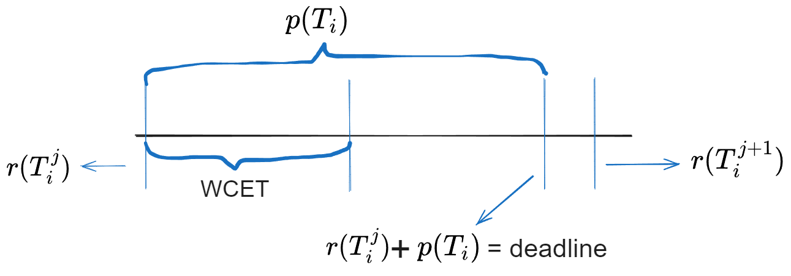
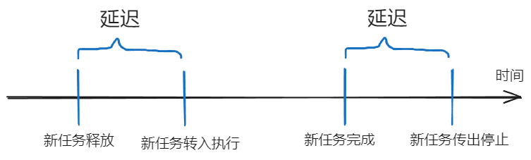
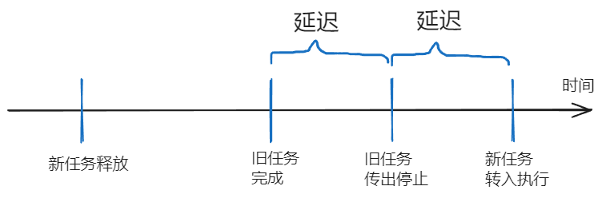
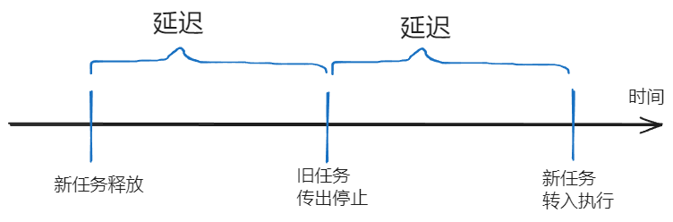
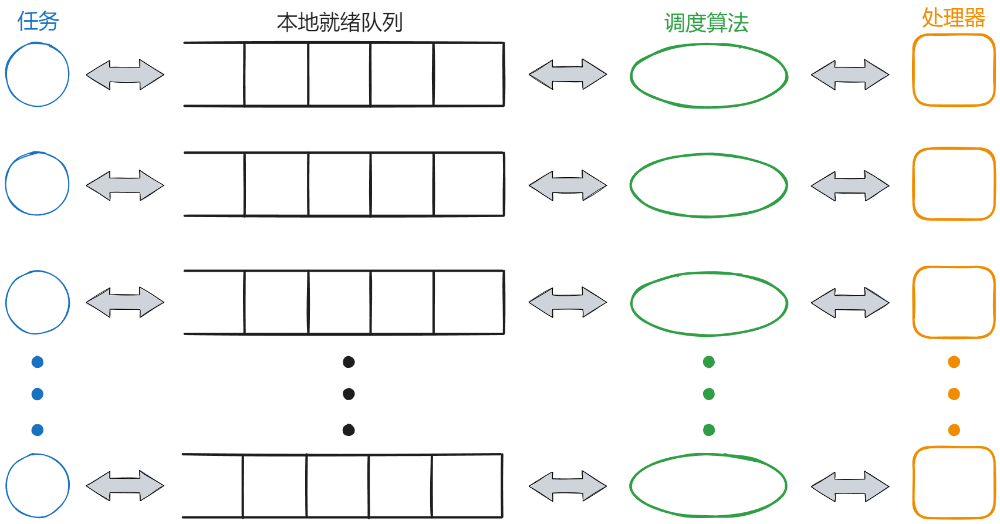
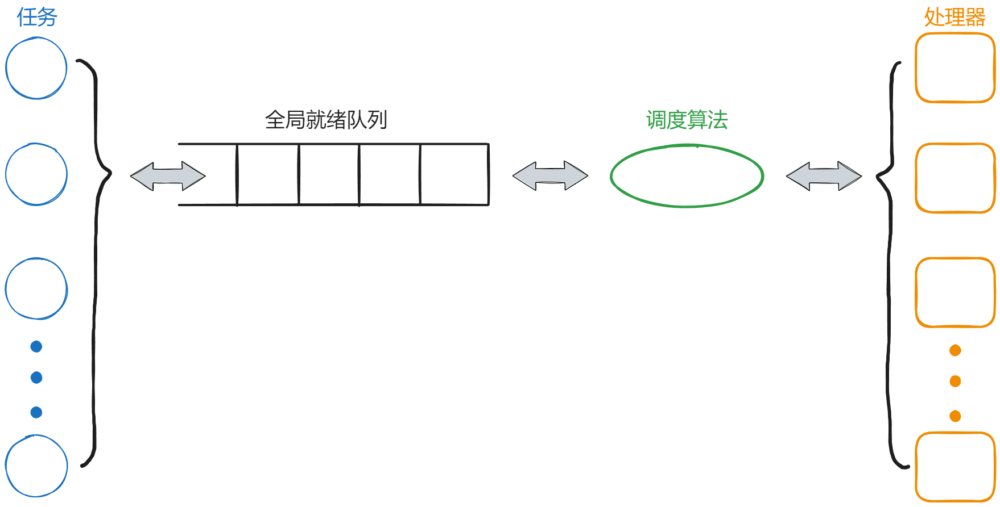
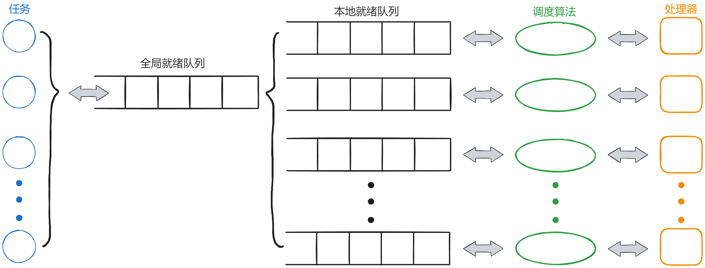

# 实时系统知识

本小节主要介绍该项目的一些前置知识，同时也相当于展示我们初期调研的学习成果。主要概述实时系统知识和Linux下实时调度算法的实现，首先介绍实时系统的分类和任务模型，接着介绍实时系统下的调度算法的集中分类并介绍多核调度算法，然后介绍Linux中实时调度算法的实现，最后列举一些目前已有的实时调度工具/补丁。

## 实时系统一些基本概念

按照时间约束的程度，实时系统可以分为强实时系统和弱实时系统两种。

**1）强实时系统**

强实时系统（Hard Real-Time System, 也称硬实时系统）：在军事等关键领域中，任务执行时间的约束性必须要得到完全满足，否则就造成重大地安全事故。因此，在这类系统的设计和实现过程中，应采用各种方法，保证在各种情况下时间约束性和功能需求都得到满足。

**2）弱实时系统**

弱实时系统（Soft Real-Time System, 也称软实时系统）：任务执行提出了时间约束性，但是可以偶尔违反这种约束性，并且对系统不会造成严重影响，如视频系统就是弱实时系统。在视频系统中，系统只需要保证绝大多数情况下视频数据能够及时传输给用户，偶尔的数据传输延迟对使用不会造成大的影响。

本项目涉及到了Linux操作系统。Linux操作系统是以一种分时操作系统，有较好的平均响应时间和较高的吞吐量，为了支持实时调度，添加了两种调度算法：SCHED_RR，SCHED_FIFO。这两种并不是针对多核条件下的实时调度算法，而是为任务赋予了实时任务的高优先级，然后根据优先级不同进行调度的算法。而实时系统主要考虑任务按时完成，尽量减少进程运行的不可预测性等。所以Linux不是一种专门的实时系统，但与商业嵌入式操作系统相比，Linux遵循GPL，具有源代码开放、定制方便、支持广泛的计算机硬件等优点，所以通过修改内核调度部分，Linux是可以很好地支持实时调度的。

## 实时系统中任务模型

在实时系统中，有多个处理器，用m（m>=1）表示。

在系统中，用任务（task）表示进程或程序，任务分为两种：随机任务（sporadic task）和周期任务（periodic task），用$T_i$表示第i个任务，1<= i <= N，N是指任务总数目。

任务（task）包含一个或多个作业（job），用jth表示任务中第j个作业，用$T_i^j$表示第i个任务的第j个作业。

对于不同的任务，其在系统中调度的顺序，是根据任务优先级（priority）的大小或者其他规则，如先到先服务算法，进行排序；而对于一个任务中的不同作业，其在该任务中的顺序是按照作业释放顺序排序的，即先释放的作业先调度。

对于作业$T_i^j$，在系统中，有以下几个基本时间概念：

1)	**释放时间（release time）**，即在释放时间之后的某个时间（可长可短），作业可以执行，用r($T_i^j$)表示。

2)	**周期（period）**，对于随机任务，周期是指任务中两个相邻作业的释放时间之间最短的时间间隔；对于周期任务，周期是固定的。对于一个任务的作业，周期是一个固定值，用p($T_i$)表示。

3)	**执行开销（execution cost）**，是指一个任务的所有作业的执行时间的最大值，即最坏情况下作业的执行时间。对于一个任务的作业，执行开销是一个固定值，用WCET（worst-case execution time）表示。

4)	**绝对死限（absolute deadline）**，是指作业应该在绝对死限之前执行完毕，否则称为丢失死限，也称为延迟（trady）。作业$T_i^j$的绝对死限为r($T_i^j$)+ p($T_i$)，那么作业$T_i^(j+1)$的释放时间r($T_i^(j+1)$)>= r($T_i^j$)+ p($T_i$)。如果对于一个任务的任意相邻两个任务总满足r($T_i^(j+1)$)= r($T_i^j$)+ p($T_i$)，那么这个任务成为周期任务。

在这四个基本时间概念中，释放时间和绝对死限是每个作业所特有的，而周期和执行开销是一个任务的所有作业所共有的。@fig:ft 表示了作业$T_i^j$的四个基本时间概念。

如果在一个系统中，所有作业的死限都不允许丢失，那么这个系统称为硬实时系统（hard real-time system）；如果一个系统允许作业的死限丢失，并且在死限之后的一定的时间内保证该任务完成，那么这个系统称为软实时系统（soft real-time system）。

以上是任务的理想调度模型，作业释放后，立刻执行等。而在实际环境中，由于物理硬件或者程序等原因，任务的调度过程中会经常出现延迟（latency），而延迟会出现在任务的释放与开始执行之间以及由于优先级不同导致任务抢占的过程中。所以，在实际跟踪实时任务的调度信息时，这些延迟必须考虑进去，否则将会影响一些数据的分析。在讲解延迟情况之前，先说明两个概念：1) 转入执行（switch to），就是作业被CPU调度，开始执行；2) 转出停止（switch away），就是作业不在被CPU调度，停止执行。下面介绍三种延迟：

1)	在空闲的CPU上，一个作业的释放与开始执行之间的延迟，完成与不再被CPU调度之间的延迟。@fig:yc1 说明了第一种延迟。

2)	在工作的CPU上，当前执行的任务的优先级高于已经释放的任务的优先级，那么新的任务必须等待旧的任务（当前执行的任务）执行完毕，才能执行。@fig:yc2 说明了第二种延迟。

3)	在工作的CPU上，当前执行的任务的优先级低于已经释放的任务的优先级，那么旧的任务必须停止，然后新的任务执行。@fig:yc3 说明了第三种延迟。

任务在生成之后，会被添加到释放队列（release queue）中，如果条件允许，在释放队列中的任务会被添加到就绪队列（ready queue）中，供CPU调度。这在运行的任务位于运行队列（run queue）中。

## 实时系统下的调度算法

实时系统下的调度算法有很多，可以按照算法的某一特征分类。本部分将讨论按照优先级对调度算法进行分类，以及按照抢占发生的原因对调度算法分类。

### 按照优先级对调度算法进行分类

优先级的对象是在系统中调度的任务或者作业，而任务或作业的优先级是由调度算法参考任务或者作业的情况以及系统当时的环境根据相关的规则确定的。根据划分的优先级的特点，可以把调度算法分为3种：

*(1) 静态优先级调度算法(static priority scheduling)*

在这种调度算法下，任务一生成，其优先级就确定下来，并且不会改变，直至任务消亡，而且任务和作业具有相同的优先级。

*RM（rate monotonic）*调度算法是这类调度算法的代表，该算法表示任务的释放频率（单位时间内释放几次任务）越大，优先级越高，使用的任务多是周期任务。由于是周期任务，任务的释放时间和释放频率是已知的，因此任务的优先级可以确定。

*(2) 受限动态优先级调度算法(restricted-dynamic-priority algorithms)*

这种调度算法又称为任务级别动态优先级、作业级别静态优先级调度算法（task-level dynamic-priority and job-level fixed-priority algorithms）。任务中作业的优先级是在作业运行时确定，因此由于运行时情况不同，一个任务中不同作业的优先级可能不同，也可能相同，但是一旦作业的优先级确定下来，不会改变，直至作业消亡。

*EDF（early deadline first）*调度算法是这类调度算法的代表，表示作业的死限时间越早，作业的优先级越大。所以在作业释放的时候，根据当时的调度情况，优先级可以确定，不再改变，直至作业消亡，并且由于每个作业释放的时候，调度情况是不相同的，所以每个作业的优先级也不是相同的。

*(3) 不受限动态优先级调度算法(unrestricted-dynamic-priority algorithms)*

这种调度算法又称为作业级别动态优先级调度算法（job-level dynamic-priority algorithms）。任务中作业的优先级在作业运行过程中是不断改变的。

*LLF（least-laxity-first）*调度算法是这类调度算法的代表。LLF调度算法是指在不丢失死限的前提下，作业的执行可以被推迟的最大时间（也被称为作业的空闲时间）越大，优先级越低，因此根据在不同时刻，空闲时间的不同，作业的优先级不同。

### 按照抢占发生的原因对调度算法进行分类

在实时系统中，抢占的发生的原因有两种，第一种是由于一些外部事件的发生，如当前执行的任务的优先级低于已释放的任务的优先级，造成后者抢占前者；第二种是由于系统内部主动发出的抢占，如在规定的时间点，系统发出抢占。因此，根据抢占发生的原因把调度算法分为两种。

*(1) 事件驱动的调度算法(event-driven scheduling)*

在这种调度算法下，抢占可能会发生在任意一个改变任务状态的事件中。如前边所提到的EDF，就是事件驱动的调度算法。

这些事件种类很多，比如硬件发出的中断，任务的挂起和恢复等。

*(2) 时间驱动的调度算法(time-driven scheduling)*

在这种调度算法下，抢占只发生在预期定义的时间点，而这些时间点与运行时的动作无关。由于这些时间点是预期定义的，如果这些时间点是周期出现的，那么这些时间点是比较容易确定的，抢占的发生也是周期事件。

最常见的例子是以量子为基础的调度算法（quantum-based scheduling），量子（quantum）又可称为时间片，同时在时间片边界处发生抢占。

### 多核调度算法

根据任务队列与CPU之间的关系，多核调度算法分为3种：

*(1) 局部性多核调度算法 (partitioning multi-core schedule)*

这种调度算法的思想是把运行任务集合中的任务分割成与处理器数目相同个数的运行队列，每个运行队列一直运行在某个处理器上，每个任务（包括所有作业）一直运行在某个处理器上，即一个处理器只对应一个运行队列。这样的运行队列相对于处理器，被称为本地运行队列。处理器在其本地运行队列上使用的调度算法可以是相同的，也可以是不同的。P-EDF（partitioning early deadline first）是这种调度算法的代表。@fig:dh1 说明了这种调度算法的思想。

*(2) 全局性多核调度算法 (global multi-core schedule)*

这种调度算法的思想是这个系统只有一个运行队列，即全局运行队列（global run queue），符合运行条件的任务会被添加到全局运行队列中，然后由唯一的调度算法调度，任务的某一个作业被安排到某一个处理器上执行，在一段时间后，这个作业有可能迁移（migration）到另外一个处理器上执行，也就是说，一个作业在不同时刻有可能运行在不同的处理器上，一个任务的两个或多个作业也有可能运行在不同的处理器上。G-EDF（global early deadline first）、PFair（proportionate fair）是这种调度算法的代表。@fig:dh2 说明这种调度算法的思想。

*(3) 两级别混合调度算法 (two-level hybrid multi-core schedule)*

顾名思义，这种调度算法是以上两种算法的结合。这种调度算法的思想是：一、第一级别调度，使用全局性调度算法，即运行任务都被安排在全局运行队列中，把不同的作业安排到不同的处理器上；二、第二级别，使用局部性调度算法，即把由第一级别调度安排的全局运行队列安排到不同本地运行队列中，不再迁移到别的处理器上或别的运行队列中，然后使用局部性调度算法把作业安排到相对应的处理器上执行。由于复杂，实现起来比较麻烦，这种调度算法目前没有代表性的调度算法。@fig:dh3 说明了这种调度算法的思想。

## Linux中实时调度算法的实现

Linux内核中有两种实时调度算法：SCHED_RR，SCHED_FIFO。这两种算法并不是针对多核条件下的实时调度算法，而是根据优先级不同进行调度的算法。

+ *SCHED_FIFO*: 先到先服务算法。一旦一个任务使用处理器，则会一直执行，直到更高优先级的任务到达或者该任务自动放弃处理器。对于相同级别的任务，系统不会发出抢占，而是等当前任务执行完毕或者调度更高优先级的任务，再去执行其他任务。
+ *SCHED_RR*: 时间片轮转算法。当一个进程首次执行之前，系统会为该进程分配一定量的时间片，并且在该进程执行时减少相应时间片的数量；当进程的时间片使用完毕后，系统会重新为该进程分配一定量的时间片，并且把该进程放在就绪队列的队尾，这样就能保证系统中每个进程都能有一定量的时间运行，在一定程度上保证了调度的公平性。SCHED_RR支持由于优先级不同而发生的抢占，即如果当前执行的任务是低优先级的，那么高优先级的任务可以抢占处理器，对于相同级别的任务，任务的执行依赖于系统分配的时间片，所以SCHED_RR可以保证相同优先级任务的调度的公平性。

在Linux系统中，每个进程通过系统调用 `sched_setscheduler()` 选择执行的调度算法。

*1. 当进程选取SCHED_FIFO调度算法时，其调用情况为：*

(1) 创建任务时通过 `sched_setscheduler()` 选择SCHED_FIFO调度算法，并设置实时优先级rt_priority(1-99)

(2) 如果没有等待资源，则将该任务加入到就绪队列中

(3) 调度程序遍历就绪队列，根据实时优先级计算调度权值(1000 + rt_priority),选择权值最高的任务使用CPU，该FIFO任务将一直占有CPU直到有优先级更高的任务就绪或者主动放弃(如等待资源)

(4) 调度程序发现有优先级更高的任务到达(高优先级任务可能被中断或定时器任务唤醒，再或被当前运行的任务唤醒，等等)，则调度程序立即在当前任务堆栈中保存当前CPU寄存器的所有数据，重新从高优先级任务的堆栈中加载寄存器数据到CPU，此时高优先级任务开始运行，然后重复第3步

(5) 如果当前任务因等待资源而主动放弃CPU使用权，则该任务将从就绪队列中删除，加入等待队列，然后重复第3步

*2. 当进程选取SCHED_RR调度算法时，其调用情况为：*

(1) 创建任务时通过 `sched_setscheduler()` 选择SCHED_RR调度算法，并设置任务的实时优先级和nice值(nice值将会转换为该任务的时间片的长度)

(2) 如果没有等待资源，则将该任务加入到就绪队列中

(3) 调度程序遍历就绪队列，根据实时优先级计算调度权值(1000 + rt_priority),选择权值最高的任务使用CPU

(4) 如果就绪队列中的任务时间片为0，则会根据nice值重新设置该任务的时间片，同时将该任务放入就绪队列的末尾，然后重复步骤3

(5) 当前任务由于等待资源而主动退出CPU，则其加入等待队列中，重复步骤3

