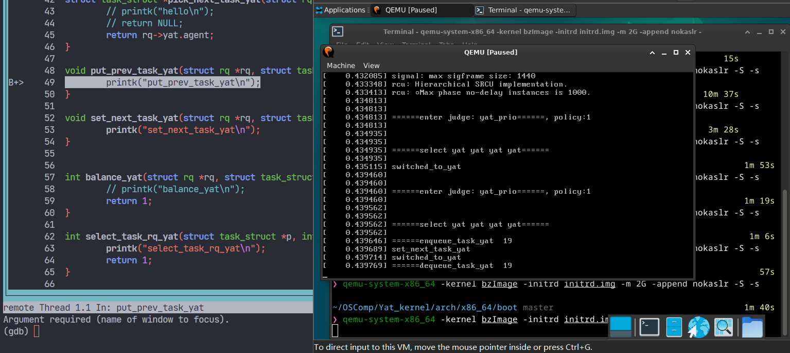

# Yat-Scheduler功能测试

## 测试概述

功能测试预计会包含很多部分，包含但不限于各模块（底层数据结构部分、调度算法部分、同步处理机制部分、调度跟踪部分、系统调用）以及调度接口的测试，目前我们已经实现了部分接口的测试。

## 测试方法

接口测试的主要方法是在关键的函数（需要测试的接口）内部使用内核调试printk语句输出对应的信息，可以顺带将参数一同输出，这样测试能够更加全面，例如在空调度器的优先级判断接口和任务出入队列接口处可以这样使用printk语句：

```c
bool yat_prio(struct task_struct *p)
{
	printk("\n\n======enter judge: yat_prio======, policy:%d \n\n", p->policy);
	// return p->policy == SCHED_YAT;
	return 1;
}

void enqueue_task_yat(struct rq *rq, struct task_struct *p, int flags) {
	rq->yat.agent = p;
	printk("======enqueue_task_yat  %d\n", p->pid);
}

void dequeue_task_yat(struct rq *rq, struct task_struct *p, int flags) {
	rq->yat.agent = NULL;
	printk("======dequeue_task_yat  %d\n", p->pid);
}
```

然后使用qemu和gdb进行调试，即进入arch/x86_64/boot目录并执行`qemu-system-x86_64 -kernel bzImage -initrd initrd.img -append nokaslr -m 2G -S -s` , 启动qemu窗口，接着在另一个命令行界面输入`gdb vmlinux` 启动gdb并加载符号表，然后输入`tar remote:1234` 连接本地qemu, 输入`b schedule` 在调度的入口处打断点，或者可以直接在想要测试的接口处打断点，然后输入c开始运行，在schedule函数处断住之后可以通过不断输入n往下执行，直到看到qemu窗口输出printk信息，即说明接口功能测试成功。

=== 测试结果



从上图可以看出，在内核启动的调度过程中调度器能进入到yat调度类中，并且输出了一系列接口名称信息，说明我们的调度接口是有效的。